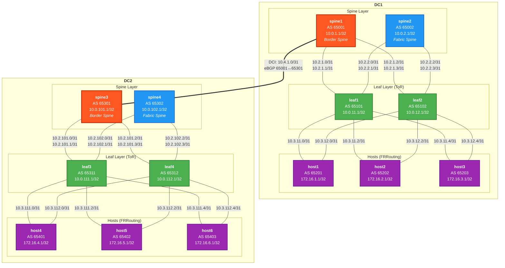
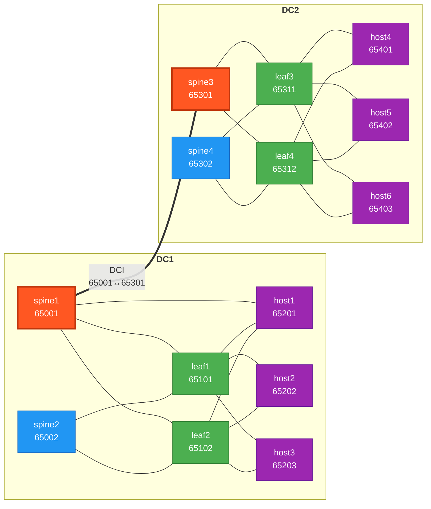
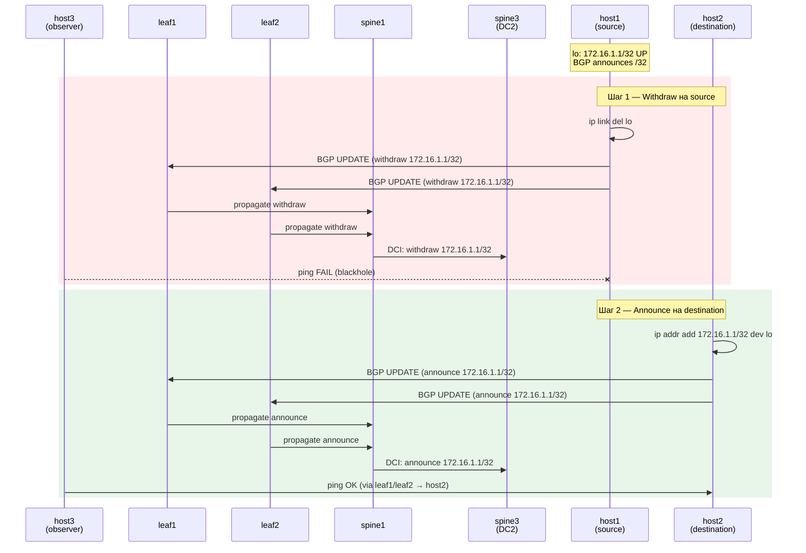
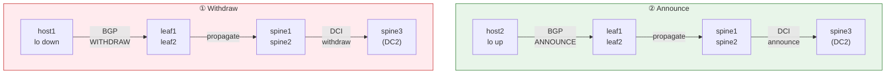

### Цель

Спроектировать и реализовать fully-routed (L3-only) сеть **двух дата-центров** на базе CLOS-топологии (Spine-Leaf) с DC Interconnect **без использования L2-доменов** — без VLAN, VxLAN, EVPN L2VNI или любых форм bridging. Все хост-линки являются маршрутизируемыми P2P-соединениями, мультихоминг хостов обеспечивается через BGP на самом хосте, а связность между ЦОД — через pure L3 DCI на базе eBGP.

### Мотивация

Традиционные multi-DC сети используют L2-stretching (VxLAN EVPN, OTV, VPLS) для расширения broadcast-доменов между площадками. Это создаёт сложности: STP-риски, ограниченный масштаб, сложные failure domains, MAC-mobility проблемы. Современные гиперскейлеры (Meta, AWS, Cloudflare) перешли к **pure L3 multi-DC fabric**, где:

- **Каждый хост — это /32 маршрут** в глобальной таблице маршрутизации
- **Нет L2-stretching** — каждый ЦОД является независимым L3-доменом
- **DCI = eBGP peering** между border-устройствами ЦОД
- **Конвергенция быстрее** — BGP withdraw за миллисекунды без MAC-flush
- **Failure isolation** — проблема в одном ЦОД не влияет на другой
- **Миграция ВМ** — workload /32 переезжает вместе с VM: BGP withdraw на старом хосте, announce на новом. Нет MAC mobility, нет ARP-gratuitous, нет tunnel re-anchor — только BGP update
- **Безопасность** — нет L2-атак, нет broadcast между площадками

### Предпосылки (из лабораторных работ)

| Работа | Тема | Что используется в проекте |
|--------|------|---------------------------|
| Lab 01 | Проектирование адресного пространства | Схема адресации `10.Dn.Sn.X/31` |
| Lab 04 | Underlay eBGP | eBGP CLOS, BFD, ECMP, Jinja2-шаблоны |
| Lab 05 | Overlay VxLAN EVPN (L2) | **Контрастный подход** — проект показывает альтернативу |

---

### Задание

Спроектировать L3-only multi-DC сеть, где:

1. **2 дата-центра**, каждый — CLOS (Spine-Leaf) с eBGP underlay.
2. Все линки (spine-leaf, leaf-host, DCI) являются **routed P2P** (/31).
3. Нет ни одного VLAN, VxLAN или L2-домена.
4. Хосты **мультихомлены** к 2 leaf-узлам своего ЦОД через 2 P2P-линка.
5. Мультихоминг реализуется через **BGP на хосте** (FRRouting).
6. Каждый хост анонсирует свой workload /32 через BGP в fabric.
7. **DCI** — eBGP-пиринг между border-spine двух ЦОД.
8. Cross-DC workload-to-workload connectivity через pure L3.
9. ECMP + BFD для балансировки и быстрой конвергенции.

---

### План работы

#### Этап 1: Проектирование топологии

##### 1.1 Общая архитектура



> **Легенда:** 🔴 Border Spine (DCI + Fabric) · 🔵 Fabric Spine · 🟢 Leaf (ToR) · 🟣 Host (FRR) · ═══ DCI link

##### 1.2 Топология DC1

| Устройство | Роль | Подключения |
|------------|------|-------------|
| **spine1** | Border Spine + Fabric | leaf1 (et1), leaf2 (et2), spine3 DCI (et3) |
| **spine2** | Fabric Spine | leaf1 (et1), leaf2 (et2) |
| **leaf1** | ToR | spine1 (et1), spine2 (et2), host1 (et3), host2 (et4), host3 (et5) |
| **leaf2** | ToR | spine1 (et1), spine2 (et2), host1 (et3), host2 (et4), host3 (et5) |
| **host1** | Server (FRR) | leaf1 (eth1), leaf2 (eth2) |
| **host2** | Server (FRR) | leaf1 (eth1), leaf2 (eth2) |
| **host3** | Server (FRR) | leaf1 (eth1), leaf2 (eth2) |

##### 1.3 Топология DC2

| Устройство | Роль | Подключения |
|------------|------|-------------|
| **spine3** | Border Spine + Fabric | leaf3 (et1), leaf4 (et2), spine1 DCI (et3) |
| **spine4** | Fabric Spine | leaf3 (et1), leaf4 (et2) |
| **leaf3** | ToR | spine3 (et1), spine4 (et2), host4 (et3), host5 (et4), host6 (et5) |
| **leaf4** | ToR | spine3 (et1), spine4 (et2), host4 (et3), host5 (et4), host6 (et5) |
| **host4** | Server (FRR) | leaf3 (eth1), leaf4 (eth2) |
| **host5** | Server (FRR) | leaf3 (eth1), leaf4 (eth2) |
| **host6** | Server (FRR) | leaf3 (eth1), leaf4 (eth2) |

##### 1.4 DCI — Data Center Interconnect

| Соединение | DC1 интерфейс | DC2 интерфейс | Описание |
|------------|---------------|---------------|----------|
| spine1 ↔ spine3 | spine1 et3 | spine3 et3 | eBGP DCI, единственный линк между ЦОД |

**DCI параметры:**
- **eBGP** между spine1 (AS 65001) и spine3 (AS 65101)
- Анонс host /32 workload-маршрутов в обе стороны
- BFD для быстрого обнаружения DCI-фейлов
- Без L2 — только L3 routing

---

#### Этап 2: Адресное пространство

Расширение схемы `10.Dn.Sn.X/31` для 2 ЦОД.

**Dn (Data Center number):**

| Dn | Назначение |
|----|------------|
| 0 | Loopback0 |
| 1 | Loopback1 (reserved) |
| 2 | Spine-Leaf P2P линки |
| 3 | Leaf-Host P2P линки |
| 4 | DCI P2P линки |
| 5 | Workload (host Loopback) |

**Sn (номер устройства):**

| Sn | DC1 | DC2 |
|----|-----|-----|
| 1 | spine1 | spine3 |
| 2 | spine2 | spine4 |
| 11 | leaf1 | leaf3 |
| 12 | leaf2 | leaf4 |

##### 2.1 Loopback0 (Router-ID)

**DC1:**

| Узел | Loopback0 | Назначение |
|------|-----------|------------|
| spine1 | 10.0.1.1/32 | BGP router-id, DCI border |
| spine2 | 10.0.2.1/32 | BGP router-id |
| leaf1 | 10.0.11.1/32 | BGP router-id |
| leaf2 | 10.0.12.1/32 | BGP router-id |

**DC2:**

| Узел | Loopback0 | Назначение |
|------|-----------|------------|
| spine3 | 10.0.101.1/32 | BGP router-id, DCI border |
| spine4 | 10.0.102.1/32 | BGP router-id |
| leaf3 | 10.0.111.1/32 | BGP router-id |
| leaf4 | 10.0.112.1/32 | BGP router-id |

##### 2.2 Spine-Leaf P2P линки (Dn=2)

**DC1:**

| Соединение | Spine et# | Spine IP | Leaf et# | Leaf IP |
|------------|-----------|----------|----------|---------|
| spine1-leaf1 | et1 | 10.2.1.0/31 | et1 | 10.2.1.1/31 |
| spine1-leaf2 | et2 | 10.2.1.2/31 | et1 | 10.2.1.3/31 |
| spine2-leaf1 | et1 | 10.2.2.0/31 | et2 | 10.2.2.1/31 |
| spine2-leaf2 | et2 | 10.2.2.2/31 | et2 | 10.2.2.3/31 |

**DC2:**

| Соединение | Spine et# | Spine IP | Leaf et# | Leaf IP |
|------------|-----------|----------|----------|---------|
| spine3-leaf3 | et1 | 10.2.101.0/31 | et1 | 10.2.101.1/31 |
| spine3-leaf4 | et2 | 10.2.101.2/31 | et1 | 10.2.101.3/31 |
| spine4-leaf3 | et1 | 10.2.102.0/31 | et2 | 10.2.102.1/31 |
| spine4-leaf4 | et2 | 10.2.102.2/31 | et2 | 10.2.102.3/31 |

##### 2.3 Leaf-Host P2P линки (Dn=3)

**DC1:**

| Соединение | Leaf et# | Leaf IP | Host eth# | Host IP |
|------------|----------|---------|-----------|---------|
| leaf1-host1 (link A) | et3 | 10.3.11.0/31 | eth1 | 10.3.11.1/31 |
| leaf1-host2 (link A) | et4 | 10.3.11.2/31 | eth1 | 10.3.11.3/31 |
| leaf1-host3 (link A) | et5 | 10.3.11.4/31 | eth1 | 10.3.11.5/31 |
| leaf2-host1 (link B) | et3 | 10.3.12.0/31 | eth2 | 10.3.12.1/31 |
| leaf2-host2 (link B) | et4 | 10.3.12.2/31 | eth2 | 10.3.12.3/31 |
| leaf2-host3 (link B) | et5 | 10.3.12.4/31 | eth2 | 10.3.12.5/31 |

**DC2:**

| Соединение | Leaf et# | Leaf IP | Host eth# | Host IP |
|------------|----------|---------|-----------|---------|
| leaf3-host4 (link A) | et3 | 10.3.111.0/31 | eth1 | 10.3.111.1/31 |
| leaf3-host5 (link A) | et4 | 10.3.111.2/31 | eth1 | 10.3.111.3/31 |
| leaf3-host6 (link A) | et5 | 10.3.111.4/31 | eth1 | 10.3.111.5/31 |
| leaf4-host4 (link B) | et3 | 10.3.112.0/31 | eth2 | 10.3.112.1/31 |
| leaf4-host5 (link B) | et4 | 10.3.112.2/31 | eth2 | 10.3.112.3/31 |
| leaf4-host6 (link B) | et5 | 10.3.112.4/31 | eth2 | 10.3.112.5/31 |

##### 2.4 DCI P2P линк (Dn=4)

| Соединение | DC1 spine et# | DC1 IP | DC2 spine et# | DC2 IP |
|------------|---------------|--------|---------------|--------|
| spine1-spine3 | et3 | 10.4.1.0/31 | et3 | 10.4.1.1/31 |

##### 2.5 Workload IP (Loopback0 на хосте)

**DC1:**

| Хост | Workload IP | Подключён к |
|------|-------------|-------------|
| host1 | 172.16.1.1/32 | leaf1, leaf2 |
| host2 | 172.16.2.1/32 | leaf1, leaf2 |
| host3 | 172.16.3.1/32 | leaf1, leaf2 |

**DC2:**

| Хост | Workload IP | Подключён к |
|------|-------------|-------------|
| host4 | 172.16.4.1/32 | leaf3, leaf4 |
| host5 | 172.16.5.1/32 | leaf3, leaf4 |
| host6 | 172.16.6.1/32 | leaf3, leaf4 |

---

#### Этап 3: BGP ASN план

**ASN-формат:** `65DXY` где D=DC#, X=роль (0=spine, 1=leaf, 2=host), Y=номер

**DC1:**

| Узел | ASN | Роль |
|------|-----|------|
| spine1 | 65001 | Border Spine (DCI + Fabric) |
| spine2 | 65002 | Fabric Spine |
| leaf1 | 65101 | ToR |
| leaf2 | 65102 | ToR |
| host1 | 65201 | Host BGP speaker |
| host2 | 65202 | Host BGP speaker |
| host3 | 65203 | Host BGP speaker |

**DC2:**

| Узел | ASN | Роль |
|------|-----|------|
| spine3 | 65101 → **65301** | Border Spine (DCI + Fabric) |
| spine4 | 65102 → **65302** | Fabric Spine |
| leaf3 | 65311 | ToR |
| leaf4 | 65312 | ToR |
| host4 | 65401 | Host BGP speaker |
| host5 | 65402 | Host BGP speaker |
| host6 | 65403 | Host BGP speaker |

> **Примечание:** ASN DC2 начинаются с `653XX` чтобы не конфликтовать с leaf ASN DC1 (`651XX`).

##### 3.1 BGP-соседства (полный список)

**DC1 — Fabric (eBGP):**

| Соседство | ASN A | ASN B |
|-----------|-------|-------|
| spine1 ↔ leaf1 | 65001 | 65101 |
| spine1 ↔ leaf2 | 65001 | 65102 |
| spine2 ↔ leaf1 | 65002 | 65101 |
| spine2 ↔ leaf2 | 65002 | 65102 |

**DC1 — Host-facing (eBGP):**

| Соседство | ASN A | ASN B |
|-----------|-------|-------|
| leaf1 ↔ host1 | 65101 | 65201 |
| leaf1 ↔ host2 | 65101 | 65202 |
| leaf1 ↔ host3 | 65101 | 65203 |
| leaf2 ↔ host1 | 65102 | 65201 |
| leaf2 ↔ host2 | 65102 | 65202 |
| leaf2 ↔ host3 | 65102 | 65203 |

**DCI (eBGP):**

| Соседство | ASN DC1 | ASN DC2 |
|-----------|---------|---------|
| spine1 ↔ spine3 | 65001 | 65301 |

**DC2 — Fabric (eBGP):**

| Соседство | ASN A | ASN B |
|-----------|-------|-------|
| spine3 ↔ leaf3 | 65301 | 65311 |
| spine3 ↔ leaf4 | 65301 | 65312 |
| spine4 ↔ leaf3 | 65302 | 65311 |
| spine4 ↔ leaf4 | 65302 | 65312 |

**DC2 — Host-facing (eBGP):**

| Соседство | ASN A | ASN B |
|-----------|-------|-------|
| leaf3 ↔ host4 | 65311 | 65401 |
| leaf3 ↔ host5 | 65311 | 65402 |
| leaf3 ↔ host6 | 65311 | 65403 |
| leaf4 ↔ host4 | 65312 | 65401 |
| leaf4 ↔ host5 | 65312 | 65402 |
| leaf4 ↔ host6 | 65312 | 65403 |

##### 3.2 Схема BGP-соседств



> **21 BGP-сессия:** 4 fabric DC1 + 4 fabric DC2 + 6 host DC1 + 6 host DC2 + 1 DCI

---

#### Этап 4: Underlay — eBGP CLOS (каждый DC)

Настройки идентичны для DC1 и DC2:

- **eBGP IPv4 Unicast** между Spine и Leaf
- **Unique ASN** на каждом узле
- **Maximum-paths 4** (ECMP)
- **BFD**: interval 100ms, min_rx 100ms, multiplier 3
- **Redistribute connected** — для анонса Loopback0 и P2P-подсетей
- Spine принимает host /32 от leaf и распространяет по fabric и через DCI

---

#### Этап 5: DCI — Data Center Interconnect

##### 5.1 DCI BGP-сессия

spine1 (DC1) и spine3 (DC2) устанавливают eBGP-соседство через DCI P2P-линк:

- **Neighbor:** 10.4.1.1 (spine3) на spine1, 10.4.1.0 (spine1) на spine3
- **Address-family:** IPv4 Unicast
- **Send host /32 routes** в обе стороны
- **BFD** на DCI-линке

##### 5.2 Route propagation через DCI

```mermaid
flowchart LR
    subgraph DC1["DC1"]
        h1["host1<br/>172.16.1.1/32"]
        lf1["leaf1 / leaf2"]
        sp1["spine1 / spine2"]
    end

    subgraph DCI["DCI"]
        dci_link["eBGP<br/>spine1 ↔ spine3"]
    end

    subgraph DC2["DC2"]
        sp3["spine3 / spine4"]
        lf3["leaf3 / leaf4"]
        h4["host4<br/>172.16.4.1/32"]
    end

    h1 -->|"BGP announce<br/>local-pref 200"| lf1
    lf1 -->|"eBGP<br/>local-pref 100"| sp1
    sp1 -->|"DCI export<br/>local-pref 50"| dci_link
    dci_link --> sp3
    sp3 -->|"eBGP"| lf3
    lf3 --> h4

    h4 -->|"BGP announce<br/>local-pref 200"| lf3
    lf3 -->|"eBGP<br/>local-pref 100"| sp3
    sp3 -->|"DCI export<br/>local-pref 50"| dci_link
    dci_link --> sp1
    sp1 -->|"eBGP"| lf1
    lf1 --> h1

    style DC1 fill:#e3f2fd,stroke:#1565C0
    style DC2 fill:#fce4ec,stroke:#c62828
    style DCI fill:#fff3e0,stroke:#e65100,stroke-width:2px
```



##### 5.3 Route policy на DCI

| Политика | Описание |
|----------|----------|
| `DCI-EXPORT` | Анонс host /32 + loopback в сторону другого ЦОД |
| `DCI-IMPORT` | Принятие host /32 от другого ЦОД с local-pref 50 |
| `DCI-FILTER` | Не анонсировать P2P-подсети fabric (Dn=2,3) — только loopback + workload |

**Local-preference hierarchy:**

| Источник маршрута | Local-preference | Приоритет |
|-------------------|-----------------|-----------|
| Directly-connected host (leaf) | 200 | Наивысший |
| Fabric (через spine, тот же DC) | 100 | Средний |
| Remote DC (через DCI) | 50 | Низший |

Это обеспечивает **shortest-path**: трафик к host в том же DC идёт через локальный leaf, трафик в другой DC — через DCI.

---

#### Этап 6: Leaf-Host connectivity — Routed P2P

##### 6.1 Leaf (host-facing интерфейсы)

- Интерфейсы в **routed mode** (no switchport): `ip address 10.3.X.Y/31`
- **BGP peering** с хостом через P2P-линк
- Анонс **default route** (`0.0.0.0/0`) в сторону хоста
- Приём host /32, redistribute в underlay BGP

##### 6.2 Хост (FRRouting)

На каждом хосте запускается **FRRouting (FRR)**:

- **Loopback0** с workload IP (172.16.X.1/32)
- **2 × eBGP-соседства** с leaf-узлами своего ЦОД
- Анонс `172.16.X.1/32` через оба BGP-соседства
- Приём default route от leaf
- **ECMP** для исходящего трафика (2 next-hop)
- **BFD** для быстрого обнаружения линк-фейлов

##### 6.3 Мультихоминг: сценарии

| Сценарий | Поведение |
|----------|-----------|
| Оба линка up | ECMP — трафик балансируется между leaf1 и leaf2 |
| Один линк down | BGP withdraw — весь трафик через оставшийся линк (<300ms) |
| Leaf failure | BFD timeout → BGP session down → маршрут отзывается |
| Spine failure | ECMP через второй spine — без влияния на host-трафик |
| DCI failure | Каждый ЦОД изолирован, intra-DC трафик не затронут |
| Весь DC2 down | Host-маршруты DC2 отзываются из DC1, intra-DC1 трафик работает |

---

#### Этап 7: Миграция виртуальных машин

В L3-only fabric миграция ВМ сводится к переносу workload /32 маршрута с одного хоста на другой. Нет необходимости в L2-stretching, MAC mobility, gratuitous ARP или tunnel re-anchoring — BGP control-plane обеспечивает автоматическое обновление маршрутов во всей сети.

##### 7.1 Модель миграции

«Виртуальная машина» моделируется workload Loopback0 с IP 172.16.X.1/32, анонсируемым через BGP. Миграция = перенос этого loopback с source host на destination host.

**Cold migration (stop-and-move):**



**BGP route propagation при миграции:**



##### 7.2 Сценарии миграции

| # | Сценарий | Source | Destination | Описание |
|---|----------|--------|-------------|----------|
| M1 | Intra-DC, same leaf pair | host1 (DC1) | host2 (DC1) | Оба host подключены к leaf1+leaf2. Маршрут обновляется на тех же leaf, spine re-advertise |
| M2 | Intra-DC, cross-rack | host1 (DC1) | host3 (DC1) | Host3 тоже к leaf1+leaf2 (в нашей топологии). Аналогично M1 |
| M3 | Cross-DC migration | host1 (DC1) | host4 (DC2) | Маршрут перемещается из DC1 в DC2: withdraw в DC1, announce в DC2 через DCI |
| M4 | Cross-DC reverse | host4 (DC2) | host1 (DC1) | Маршрут перемещается из DC2 в DC1 |

##### 7.3 Конвергенция при миграции

**Timeline (cold migration):**

```mermaid
gantt
    title Cold Migration Convergence Timeline
    dateFormat x
    axisFormat %L ms

    section Withdraw (source)
    host1: lo down                    :w0, 0, 50
    FRR: BGP WITHDRAW                 :w1, 50, 100
    leaf1/leaf2: RIB update           :w2, 100, 200
    spine1/2: fabric update           :w3, 200, 300
    spine3 (DCI): withdraw            :w4, 300, 400

    section Announce (destination)
    host2: lo up                      :a0, 0, 50
    FRR: BGP ANNOUNCE                 :a1, 50, 100
    leaf1/leaf2: RIB update           :a2, 100, 200
    spine1/2: propagate               :a3, 200, 300
    spine3 (DCI): announce            :a4, 300, 500

    section Convergence
    Intra-DC recovered (~500ms)       :crit, done, c1, 500, 501
    Cross-DC recovered (~800ms)       :crit, done, c2, 800, 801
```



**Итого:** convergence ~500ms intra-DC, ~800ms cross-DC (через DCI).

**Packet loss during migration:**

| Метрика | Intra-DC | Cross-DC |
|---------|----------|----------|
| Потеря пакетов | ~200–500ms | ~400–800ms |
| Потерянные пакеты (ping 10ms interval) | ~20–50 | ~40–80 |
| Восстановление | Автоматическое (BGP) | Автоматическое (BGP через DCI) |
| Blackhole | Возможен между withdraw и announce | Возможен + DCI latency |

##### 7.4 Скрипты миграции

**`migrate_from.sh`** — выполняется на source host:

```bash
#!/bin/bash
# Снять workload IP → BGP withdraw
ip link del lo type dummy 2>/dev/null
echo "[$(date +%T)] Workload IP withdrawn from $(hostname)"
```

**`migrate_to.sh`** — выполняется на destination host:

```bash
#!/bin/bash
WORKLOAD_IP="${1:?Usage: migrate_to.sh <workload_ip/32>}"
# Поднять workload IP → BGP announce
ip link add lo type dummy 2>/dev/null || true
ip addr add "$WORKLOAD_IP" dev lo
ip link set lo up
echo "[$(date +%T)] Workload IP $WORKLOAD_IP announced from $(hostname)"
```

**`migrate.sh`** — оркестратор миграции (запуск с хост-машины):

```bash
#!/bin/bash
# Миграция workload IP с source host на destination host
SRC_HOST="${1:?Source host container name}"
DST_HOST="${2:?Destination host container name}"
WORKLOAD_IP="${3:?Workload IP/32, e.g. 172.16.1.1/32}"

echo "=== Migrating $WORKLOAD_IP: $SRC_HOST → $DST_HOST ==="

# Шаг 1: Withdraw на source
echo "[1/2] Withdrawing from $SRC_HOST..."
docker exec "$SRC_HOST" bash -c "ip link del lo 2>/dev/null || ip addr del $WORKLOAD_IP dev lo"

# Шаг 2: Announce на destination
echo "[2/2] Announcing on $DST_HOST..."
docker exec "$DST_HOST" bash -c "ip link add lo type dummy 2>/dev/null || true; ip addr add $WORKLOAD_IP dev lo; ip link set lo up"

echo "=== Migration complete ==="
```

##### 7.5 Проверка миграции

После миграции host1 (172.16.1.1/32) → host2 на всех узлах fabric:

```
# leaf1 — маршрут теперь через host2, а не host1
leaf1# show ip bgp 172.16.1.1/32
  Paths: (1 available, best 1)
    10.3.12.1 from host2 (65202)    ← был 10.3.11.1 from host1 (65201)
    10.3.12.3 from host2 (65202)    ← был 10.3.12.1 from host1 (65201)

# spine1 — next-hop изменился
spine1# show ip bgp 172.16.1.1/32
  via leaf1/leaf2 (те же nexthop, но BGP peer = host2)
```

##### 7.6 Сравнение: миграция в L3-only vs L2 overlay

| Аспект | L3-only (BGP) | L2 overlay (VxLAN EVPN) |
|--------|---------------|------------------------|
| Что перемещается | /32 маршрут (BGP update) | MAC+IP (EVPN Type 2) |
| Control-plane | BGP withdraw + announce | EVPN MAC mobility (seq number) |
| ARP | Не нужен (P2P) | Gratuitous ARP на новом VTEP |
| MAC-таблицы | Отсутствуют | Flush на старом VTEP, relearn на новом |
| Tunnel re-anchor | Не нужен | Обновление VTEP IP в EVPN |
| Конвергенция | BGP propagation (~500ms intra-DC) | EVPN update + MAC flush (~1–3s) |
| Packet loss | ~20–50 пакетов | ~100–300 пакетов |
| Complexity | Низкая (только BGP) | Высокая (MAC mobility + ARP + tunnel) |
| Cross-DC | BGP через DCI (~800ms) | EVPN DCI + MAC mobility + VTEP re-anchor |
| Duplicate IP risk | Невозможен (маршрут уникален) | Возможен при race condition (split-brain) |

---

#### Этап 8: Конфигурация устройств

##### 8.1 Файловая структура

```
final_project/
├── README.md
├── Makefile
├── images/
│   └── topology.png
├── netlab/
│   ├── topology.yml          # Топология (2 DC: nodes, links, groups)
│   ├── ip-plan.yml           # Централизованный IP-план (оба ЦОД + DCI)
│   ├── ipplan.py             # netlab-плагин для загрузки IPs
│   ├── spine.j2              # Шаблон конфигурации Spine (fabric + DCI для border)
│   ├── leaf.j2               # Шаблон конфигурации Leaf (fabric + host-facing)
│   ├── bfd.j2                # Шаблон BFD
│   ├── host-frr.conf.j2     # Шаблон конфигурации FRR на хосте
│   ├── host1.sh .. host6.sh  # Скрипты инициализации хостов (FRR + конфиг)
│   ├── dci.j2                # Шаблон DCI-конфигурации для border-spine
│   ├── migrate_from.sh       # Снять workload IP на source host (BGP withdraw)
│   ├── migrate_to.sh         # Поднять workload IP на destination host (BGP announce)
│   └── migrate.sh            # Оркестратор миграции (docker exec)
└── tests/
    ├── test_l3_only.robot          # Функциональные тесты (intra-DC)
    ├── test_dci.robot              # Тесты DCI и cross-DC
    ├── test_migration.robot        # Тесты миграции ВМ (intra-DC + cross-DC)
    ├── test_capture.robot          # Захват пакетов
    ├── test_convergence.robot      # Тесты конвергенции (bounce)
    └── keywords/
        ├── common.resource         # Общие keyword-ы
        └── migration.resource      # Keyword-ы для миграции (withdraw/announce/ping)
```

##### 8.2 Ключевые конфигурационные элементы

**Border Spine (spine1, spine3):**
- eBGP с leaf своего ЦОД (fabric)
- eBGP с border-spine другого ЦОД (DCI)
- Route-policy: анонс host /32 через DCI, фильтрация P2P-подсетей
- BFD на всех линках включая DCI
- ECMP maximum-paths 4

**Fabric Spine (spine2, spine4):**
- eBGP с leaf своего ЦОД (fabric only)
- BFD, ECMP — как в lab_04

**Leaf (все):**
- eBGP со spine своего ЦОД (fabric)
- eBGP с 3 хостами (host-facing P2P)
- Route-map: accept host /32, redistribute в fabric BGP
- Route-map: send default в сторону хоста
- Local-pref 200 для directly-connected host routes
- BFD на всех линках

**Host (FRRouting):**
- Loopback0: 172.16.X.1/32
- 2 × eBGP с leaf своего ЦОД
- Network statement: 172.16.X.1/32
- BFD на обоих P2P-линках
- ECMP для исходящего трафика

---

#### Этап 9: Тестирование

##### 9.1 Функциональные тесты — Intra-DC (Robot Framework)

| Группа | Тестов | Описание |
|--------|--------|----------|
| Lab lifecycle | 2 | `netlab up` / `netlab down` |
| DC1 Underlay BGP | 4 | eBGP spine-leaf Established (spine1↔leaf1/2, spine2↔leaf1/2) |
| DC2 Underlay BGP | 4 | eBGP spine-leaf Established (spine3↔leaf3/4, spine4↔leaf3/4) |
| DC1 Host BGP | 6 | eBGP leaf-host Established (leaf1↔host1/2/3, leaf2↔host1/2/3) |
| DC2 Host BGP | 6 | eBGP leaf-host Established (leaf3↔host4/5/6, leaf4↔host4/5/6) |
| DC1 BFD | 2 | BFD Up на spine-leaf и leaf-host линках |
| DC2 BFD | 2 | BFD Up на spine-leaf и leaf-host линках |
| DC1 Host routes | 6 | 172.16.{1,2,3}.1/32 в RIB всех узлов DC1 |
| DC2 Host routes | 6 | 172.16.{4,5,6}.1/32 в RIB всех узлов DC2 |
| Intra-DC1 ping | 9 | host1↔host2↔host3 (workload-to-workload) |
| Intra-DC2 ping | 9 | host4↔host5↔host6 (workload-to-workload) |
| ECMP intra-DC | 6 | Трафик через оба leaf (traceroute) |
| Default route | 6 | Каждый host получает default от leaf |
| No L2 | 4 | Отсутствие VLAN, VxLAN, MAC-таблиц на всех leaf |

##### 9.2 Функциональные тесты — DCI и Cross-DC

| Группа | Тестов | Описание |
|--------|--------|----------|
| DCI BGP | 2 | eBGP spine1↔spine3 Established, BFD Up |
| DCI routes DC1→DC2 | 3 | 172.16.{4,5,6}.1/32 в RIB spine1, leaf1, leaf2 |
| DCI routes DC2→DC1 | 3 | 172.16.{1,2,3}.1/32 в RIB spine3, leaf3, leaf4 |
| Cross-DC ping | 9 | host1↔host4, host2↔host5, host3↔host6 и все комбинации |
| Cross-DC ECMP | 3 | Трафик через DCI использует оба spine (intra-DC ECMP) |
| Local-pref | 3 | Local host маршруты preferred over DCI маршруты |

##### 9.3 Тесты захвата пакетов

| Группа | Описание |
|--------|----------|
| BFD capture | BFD-пакеты: interval 100ms, TTL 255, на fabric и DCI |
| BGP capture | BGP Open/Update/Keepalive на host-facing и DCI линках |
| Intra-DC ICMP | Workload ping внутри DC: src=172.16.X.1, dst=172.16.Y.1 |
| Cross-DC ICMP | Workload ping между DC: src=172.16.1.1, dst=172.16.4.1 |
| ECMP capture | Разные src-port → разные next-hop (hash-based) |
| DCI ICMP | Пакет на DCI-линке: outer IP spine1→spine3, inner workload IP |

##### 9.4 Тесты конвергенции (bounce)

| Сценарий | Ожидаемое поведение |
|----------|-------------------|
| Bounce host link A (DC1) | Трафик host1 переключается на link B через leaf2, downtime < 1s |
| Bounce leaf uplink (DC1) | Host теряет одного BGP-соседа, трафик через второй leaf |
| Bounce DCI линк | Cross-DC трафик прекращается, intra-DC не затронут |
| DCI recovery | BGP re-establish, host /32 маршруты re-advertise, cross-DC ping восстанавливается |
| Host BGP restart | Graceful restart — маршруты сохраняются в RIB leaf |

##### 9.5 Тесты миграции виртуальных машин (`test_migration.robot`)

Тесты верифицируют корректность переноса workload /32 между хостами и convergence fabric.

**Setup:** непрерывный ping workload IP с другого хоста (10ms interval) для измерения packet loss.

**M1 — Intra-DC миграция (host1 → host2, DC1):**

| # | Тест | Описание |
|---|------|----------|
| 1 | Pre-migration ping | host3 → 172.16.1.1 — ping успешен, маршрут через host1 |
| 2 | Pre-migration BGP route | leaf1: `show ip bgp 172.16.1.1/32` — next-hop через host1 |
| 3 | Migrate: withdraw on host1 | `docker exec host1 ip link del lo` — BGP withdraw |
| 4 | Post-withdraw blackhole | leaf1: маршрут 172.16.1.1/32 отсутствует (withdrawn) |
| 5 | Migrate: announce on host2 | `docker exec host2 ip addr add 172.16.1.1/32 dev lo` — BGP announce |
| 6 | Post-migration BGP route | leaf1: `show ip bgp 172.16.1.1/32` — next-hop через host2 |
| 7 | Post-migration BGP route (spine) | spine1: маршрут к 172.16.1.1/32 обновлён |
| 8 | Post-migration ping | host3 → 172.16.1.1 — ping успешен, маршрут через host2 |
| 9 | Packet loss measurement | Подсчёт потерянных пакетов за время миграции (< 50) |
| 10 | Cross-DC route update | spine3 (DC2): маршрут к 172.16.1.1/32 обновлён через DCI |

**M3 — Cross-DC миграция (host1 → host4, DC1 → DC2):**

| # | Тест | Описание |
|---|------|----------|
| 1 | Pre-migration cross-DC ping | host5 (DC2) → 172.16.1.1 (host1, DC1) — через DCI |
| 2 | Pre-migration DCI route | leaf3 (DC2): маршрут к 172.16.1.1/32 через DCI |
| 3 | Migrate: withdraw on host1 | `docker exec host1 ip link del lo` |
| 4 | DC1 route withdrawal | leaf1/spine1: маршрут отозван |
| 5 | DCI route withdrawal | leaf3 (DC2): маршрут к 172.16.1.1/32 удалён |
| 6 | Migrate: announce on host4 (DC2) | `docker exec host4 ip addr add 172.16.1.1/32 dev lo` |
| 7 | DC2 local route | leaf3: 172.16.1.1/32 теперь local (directly-connected) |
| 8 | DC1 cross-DC route | leaf1 (DC1): маршрут к 172.16.1.1/32 теперь через DCI |
| 9 | Post-migration ping | host5 (DC2) → 172.16.1.1 — ping через локальный leaf |
| 10 | Post-migration cross-DC ping | host2 (DC1) → 172.16.1.1 — ping через DCI |
| 11 | Packet loss measurement | Подсчёт потерянных пакетов (< 80) |
| 12 | Convergence time | Измерение времени от announce до ping recovery (< 1s) |

**M5 — Миграция с параллельным трафиком (stress test):**

| # | Тест | Описание |
|---|------|----------|
| 1 | Start continuous ping (DC) | host3 → 172.16.1.1, interval 10ms |
| 2 | Start continuous ping (cross-DC) | host5 → 172.16.2.1, interval 10ms |
| 3 | Migrate VM 1 (host1→host2) | Intra-DC |
| 4 | Verify VM 1 recovery | Ping восстанавливается < 1s |
| 5 | Migrate VM 2 (host4→host5) | Intra-DC DC2, параллельно |
| 6 | Verify VM 2 recovery | Ping восстанавливается < 1s |
| 7 | Both migrations successful | Оба workload доступны, packet loss в допустимых пределах |

**M6 — Захват пакетов при миграции:**

| # | Тест | Описание |
|---|------|----------|
| 1 | Capture BGP WITHDRAW | tcpdump на leaf1: BGP Update (withdraw 172.16.1.1/32) от host1 |
| 2 | Capture BGP ANNOUNCE | tcpdump на leaf1: BGP Update (announce 172.16.1.1/32) от host2 |
| 3 | Capture DCI propagation | tcpdump на spine1 DCI: BGP Update проходит через DCI |
| 4 | ICMP before/after | Ping-пакеты: до миграции src=host1, после — src=host2 |

---

#### Этап 10: Документация и анализ

##### 10.1 Сравнение L3-only vs L2 overlay (multi-DC)

| Аспект | L3-only (этот проект) | L2 overlay (VxLAN EVPN DCI) |
|--------|----------------------|----------------------------|
| DCI | eBGP peering spine-to-spine | VxLAN EVPN между VTEP разных DC |
| Host connectivity | Routed P2P (/31) | Switched (VLAN access) |
| Host multi-homing | BGP на хосте (2 eBGP-сессии) | VxLAN EVPN (MAC learning) |
| Cross-DC трафик | L3 routing через DCI | VxLAN-туннель поверх DCI |
| Broadcast/BUM | Отсутствует | Ingress Replication через EVPN Type 3 |
| ARP | Не нужен (P2P /31) | Proxy ARP / flooding |
| MAC-таблицы | Отсутствуют | EVPN MAC learning per DC |
| Failure isolation | Полная — DCI down = изоляция | Частичная — MAC mobility проблемы |
| Миграция ВМ | BGP withdraw/announce (~500ms) | EVPN MAC mobility + gARP (~1–3s) |
| Cross-DC миграция | BGP через DCI (~800ms) | EVPN DCI + MAC mobility + VTEP re-anchor |
| Конвергенция DCI | BFD + BGP withdraw (~300ms) | BFD + EVPN withdraw + MAC re-learn |
| Сложность | Низкая (только L3) | Высокая (VxLAN + EVPN + DCI tunnel + VTEP) |
| Масштабируемость | Ограничена BGP table size | Ограничена VNI + MAC table |
| Ограничения | Хост должен уметь BGP | Работает с любым L2-хостом |
| Use-case | Cloud-native, микросервисы | VM migration, legacy apps |

##### 10.2 Packet walkthrough — Cross-DC

Путь пакета при пинге host1 (DC1, 172.16.1.1) → host4 (DC2, 172.16.4.1):

```
host1 (172.16.1.1)
  └→ src: 172.16.1.1, dst: 172.16.4.1
  └→ ECMP: next-hop leaf1 (10.3.11.0) via eth1
     └→ leaf1 lookup: 172.16.4.1/32 via spine1 (10.2.1.0) [ECMP, spine2 тоже возможен]
        └→ spine1 lookup: 172.16.4.1/32 via spine3 DCI (10.4.1.1)
           └→ spine3 lookup: 172.16.4.1/32 via leaf3 (10.2.101.1) [ECMP]
              └→ leaf3 lookup: 172.16.4.1/32 via host4 (10.3.111.1)
                 └→ host4 (172.16.4.1)

Reverse: host4 → host1
  └→ ECMP: next-hop leaf3 (10.3.111.0) via eth1
     └→ leaf3 → spine3 → spine1 (DCI) → leaf1 → host1
```

**TTL на каждом хопе:**

| Хоп | Устройство | TTL |
|-----|-----------|-----|
| 0 | host1 | 64 |
| 1 | leaf1 | 63 |
| 2 | spine1 | 62 |
| 3 | spine3 (DCI) | 61 |
| 4 | leaf3 | 60 |
| 5 | host4 | 59 |

##### 10.3 Диаграммы

- Топология 2 DC с IP-адресацией, ASN и DCI
- BGP-соседства: fabric (intra-DC) + host-facing + DCI
- Путь пакета intra-DC (host1 → host3) и cross-DC (host1 → host4)
- BGP route propagation: host /32 от leaf через spine через DCI
- Конвергенция при DCI-failure (timeline)
- Миграция ВМ: timeline BGP withdraw → announce → convergence

---

### Критерии приёмки

- [ ] Топология 2 DC развёрнута через `netlab up` + `containerlab` (14 контейнеров)
- [ ] Все eBGP-соседства Established: fabric (8), host-facing (12), DCI (1) = **21 BGP-сессия**
- [ ] BFD Up на всех линках (fabric + host + DCI)
- [ ] Host /32 workload-маршруты DC1 доступны в DC2 и наоборот
- [ ] Intra-DC ping успешен (host1↔host2↔host3, host4↔host5↔host6)
- [ ] Cross-DC ping успешен (host1↔host4, host2↔host5, host3↔host6 и все комбинации)
- [ ] ECMP работает intra-DC (трафик через оба leaf)
- [ ] При bounce host-линка трафик переключается на второй (<1s)
- [ ] При DCI-failure intra-DC трафик не затронут, cross-DC восстанавливается после DCI recovery
- [ ] Local-pref обеспечивает prefer-local: трафик к host своего DC идёт через локальный leaf
- [ ] Intra-DC миграция ВМ: workload /32 переносится с host1 на host2, ping восстанавливается < 1s
- [ ] Cross-DC миграция ВМ: workload /32 переносится из DC1 в DC2, маршруты обновляются через DCI < 1s
- [ ] Захват BGP WITHDRAW/ANNOUNCE при миграции подтверждает корректный route propagation
- [ ] Нет ни одного VLAN, VxLAN, switchport в конфигурации
- [ ] Все тесты Robot Framework проходят (100%)
- [ ] Захват пакетов подтверждает pure L3 forwarding (нет L2-инкапсуляции)

---

### Инструменты и зависимости

| Инструмент | Назначение |
|------------|------------|
| netlab | Оркестрация топологии, генерация конфигураций |
| containerlab | Контейнерная симуляция сети |
| Arista cEOS 4.34.2.2F | NOS для spine/leaf (8 устройств) |
| FRRouting (FRR) | BGP-агент на хостах (6 устройств) |
| Ubuntu 22.04 | Базовый образ для хостов |
| Robot Framework | Автоматическое тестирование |
| tcpdump | Захват и анализ пакетов |
| Jinja2 | Шаблоны конфигураций |

**Ресурсы:** 14 контейнеров (8 cEOS + 6 Ubuntu/FRR)

---

### Сроки и порядок выполнения

| # | Этап | Содержание |
|---|------|------------|
| 1 | Проектирование | Топология 2 DC, IP-план, BGP ASN, DCI design, route-policy |
| 2 | Underlay DC1 | Адаптация eBGP CLOS из lab_04 для DC1 (2 spine + 2 leaf) |
| 3 | Underlay DC2 | Аналогично DC1 — eBGP CLOS для DC2 |
| 4 | DCI | Настройка eBGP-пиринга spine1↔spine3, route-policy |
| 5 | Host BGP | Конфигурация FRR на 6 хостах, eBGP leaf-host |
| 6 | Route policy | Route-maps, prefix-lists, local-preference (200/100/50) |
| 7 | Миграция ВМ | Скрипты migrate_from/to.sh, migrate.sh, FRR network statement tuning |
| 8 | Тестирование | Robot Framework: intra-DC + DCI + cross-DC + migration + capture + convergence |
| 9 | Документация | README, диаграммы, packet walkthrough, migration walkthrough, сравнение с L2 overlay |

---

### Ссылки

- Lab 04 — Underlay eBGP: [README](../lab_04/README.md)
- Lab 05 — Overlay VxLAN EVPN (L2): [README](../lab_05/README.md)
- RFC 7938 — Use of BGP for Routing in Large-Scale Data Centers
- RFC 4271 — A Border Gateway Protocol 4 (BGP-4)
- RFC 5880 — Bidirectional Forwarding Detection (BFD)
- RFC 6241 — Network Configuration Protocol (NETCONF)
- Meta Data Center Fabric — [Engineering at Meta](https://engineering.fb.com/)
