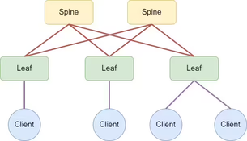

## Проектирование адресного пространства
---
### Задание:
Cобрать схему `CLOS` и распределить адресное пространство.

#### Реализовать топологию сети как на схеме:


---
### Решение


#### Распространенные схемы :

##### 1. **Топологическая схема (Topology-based)**

Формат: `10.<spine_id>.<leaf_id>.<link_type>/31`

- Окта 2 = номер spine
- Окта 3 = номер leaf
- Окта 4 = тип линка (0=loopback, 1-128=P2P)

##### 2. **Схема по ЦОД (Data Center-based)**

Формат: `10.Dn.Sn.X/31`

- Dn = номер ЦОД (0=loopback1, 1=loopback2, 2=p2p, 4-7=сервисы)
- Sn = номер spine
- X = последовательный номер

##### 3. **Функциональная схема (Role-based)**

Формат: `10.<role>.<pod>.<id>/31`

- Окта 2 = роль (1=spine, 2=leaf, 3=border, 4=service)
- Окта 3 = pod/группа
- Окта 4 = номер устройства

##### 4. **Схема с иерархией (Hierarchical)**

Формат: `10.<region>.<site>.<rack>.<device>/31`

- Для крупных мульти-ЦОД развертываний
- Позволяет агрегировать префиксы по регионам/сайтам

##### 5. **Схема BGP ASN-based**

IP привязаны к BGP ASN:

- `10.<ASN-last-octet>.<link_type>.<id>/31`
- ASN 65001 → `10.1.X.X/32`
- ASN 65101 → `10.101.X.X/32`

##### 6. **Схема VLSM (Variable Length Subnet Mask)**

Использует разные маски для разных типов:

- Loopback: `/32`
- P2P линки: `/31`
- Сервисные сети: `/24` или `/25`
- Management: `/24`

---

##### Сравнение подходов

| Схема          | Плюсы                   | Минусы                  | Когда использовать  |
| -------------- | ----------------------- | ----------------------- | ------------------- |
| Топологическая | Простая, легко читать   | Не масштабируется       | Малые сети (1 ЦОД)  |
| DC-based       | Поддержка мульти-ЦОД    | Требует планирования Dn | Мульти-ЦОД          |
| Role-based     | Гибкая для разных ролей | Сложнее агрегация       | Сложные топологии   |
| Иерархическая  | Отличная агрегация      | Сложная                 | Крупные провайдеры  |
| ASN-based      | Привязка к BGP          | Нестандартная           | BGP-ориентированные |

**Для нашей underlay сети используем рекомендованную схему ЦОД (2).**

Сформируем адресный план CLOS сети

**Топология:** 2 Spine + 3 Leaf 

**Формат адресации:** `10.Dn.Sn.X/31`

```
Loopback'и:
     - Spine: 10.0.{Sn}.1/32 (Loopback0), 10.1.{Sn}.1/32 (Loopback1)
     - Leaf: 10.0.{11+leaf_num}.1/32, 10.1.{11+leaf_num}.1/32

    P2P-линки (/31):
     - Spine1: 10.2.1.0/31, 10.2.1.2/31, 10.2.1.4/31
     - Spine2: 10.2.2.0/31, 10.2.2.2/31, 10.2.2.4/31
     - Leaf'ы используют нечётные адреса в тех же подсетях (другая сторона линка)

    Dn: 0=loopback0, 1=loopback1, 2=p2p. Sn: 1-2 для spine, 11-13 для leaf.
```

### Адресный план underlay сети:

##### Loopback интерфейсы

| Node   | Interface | IP Address   | Description      |
| ------ | --------- | ------------ | ---------------- |
| spine1 | Loopback0 | 10.0.1.1/32  | Spine1-Loopback0 |
| spine1 | Loopback1 | 10.1.1.1/32  | Spine1-Loopback1 |
| spine2 | Loopback0 | 10.0.2.1/32  | Spine2-Loopback0 |
| spine2 | Loopback1 | 10.1.2.1/32  | Spine2-Loopback1 |
| leaf1  | Loopback0 | 10.0.11.1/32 | Leaf1-Loopback0  |
| leaf1  | Loopback1 | 10.1.11.1/32 | Leaf1-Loopback1  |
| leaf2  | Loopback0 | 10.0.12.1/32 | Leaf2-Loopback0  |
| leaf2  | Loopback1 | 10.1.12.1/32 | Leaf2-Loopback1  |
| leaf3  | Loopback0 | 10.0.13.1/32 | Leaf3-Loopback0  |
| leaf3  | Loopback1 | 10.1.13.1/32 | Leaf3-Loopback1  |

##### P2P линки

| Link         | Node A Interface | Node A IP   | Node B Interface | Node B IP   |
| ------------ | ---------------- | ----------- | ---------------- | ----------- |
| spine1-leaf1 | Ethernet1        | 10.2.1.0/31 | Ethernet1        | 10.2.1.1/31 |
| spine1-leaf2 | Ethernet2        | 10.2.1.2/31 | Ethernet1        | 10.2.1.3/31 |
| spine1-leaf3 | Ethernet3        | 10.2.1.4/31 | Ethernet1        | 10.2.1.5/31 |
| spine2-leaf1 | Ethernet1        | 10.2.2.0/31 | Ethernet2        | 10.2.2.1/31 |
| spine2-leaf2 | Ethernet2        | 10.2.2.2/31 | Ethernet2        | 10.2.2.3/31 |
| spine2-leaf3 | Ethernet3        | 10.2.2.4/31 | Ethernet2        | 10.2.2.5/31 |

### Практическая часть

Установка и запуск `netlab ` описана в соответствующем [разделе](../setup/README.md)
Для наглядности используем встраиваемые блоки конфигурации через секцию `config.inline`
Итоговый [файл конфигурации](netlab/topology.yml).
Для запуска/остановки используем команды:
```
$ netlab up / $ netlab down
```
