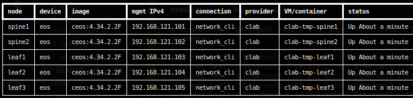
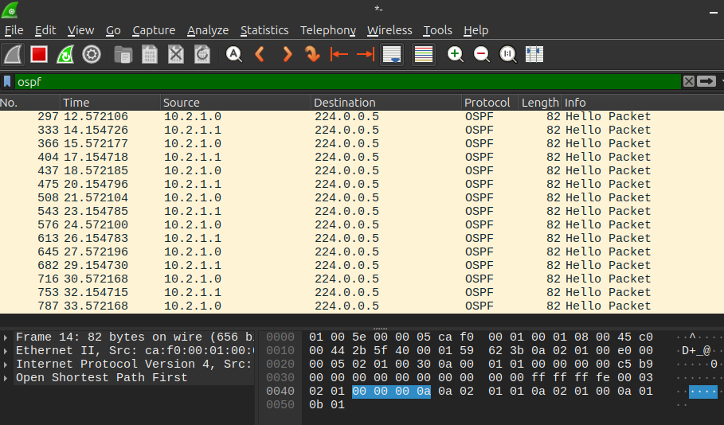
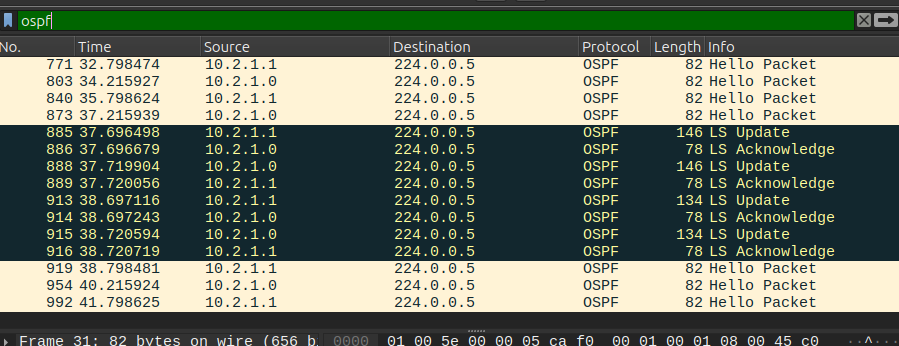
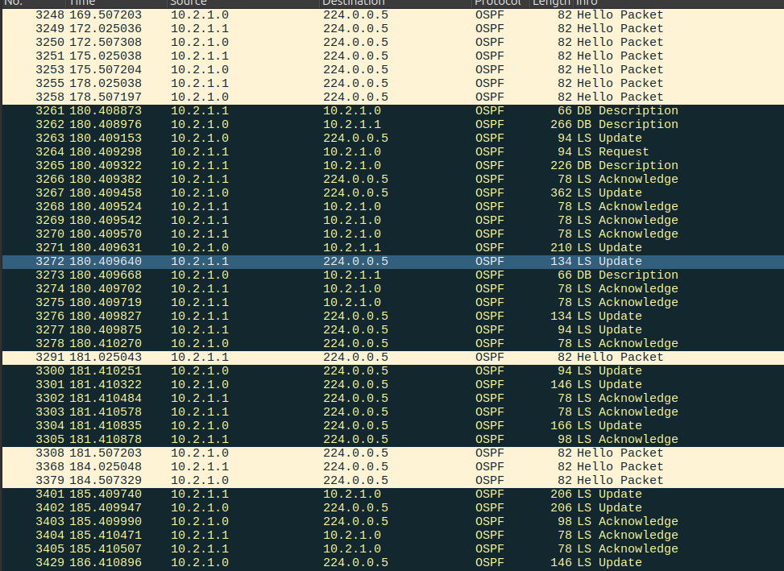
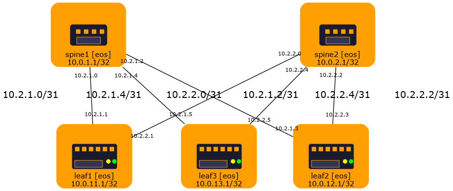

## Udrelay OSPF
---
### Задание:
Настроить OSPF для Underlay сети.

---
### План работы:
 - Распределить адресное пространство underlay сети.
 - Разработать конфигурацию устройств с использованием симулятора netlab.
 - Выполнить практическую часть - yбедится в наличии связности устройств в OSPF домене. 

---

### Решение:
Распределение адресного пространства выполнено как в предыдущей [работе](../lab_01/README.md):
<details>
<summary>Используем рекомендованную схему ЦОД (2).</summary>

**Топология CLOS:** 2 Spine + 3 Leaf 

**Формат адресации:** `10.Dn.Sn.X/31`
Где:
- **Dn** (Data Center number):
  - `0` = Loopback0
  - `1` = Loopback1
  - `2` = P2P линки
  - `3` = Зарезервировано
  - `4-7` = Services
- **Sn** (Номер Spine):
  - `1-2` = Spine switches
  - `11-13` = Leaf switches
- **X** = Sequential number (порядковыйй номер)

**Интерфейсы Loopback**

| Узел (нода) | Интерфейс | IP адрес | Соединение |
|------|-----------|------------|-------------|
| spine1 | Loopback0 | 10.0.1.1/32 | Spine1-Loopback0 |
| spine1 | Loopback1 | 10.1.1.1/32 | Spine1-Loopback1 |
| spine2 | Loopback0 | 10.0.2.1/32 | Spine2-Loopback0 |
| spine2 | Loopback1 | 10.1.2.1/32 | Spine2-Loopback1 |
| leaf1 | Loopback0 | 10.0.11.1/32 | Leaf1-Loopback0 |
| leaf1 | Loopback1 | 10.1.11.1/32 | Leaf1-Loopback1 |
| leaf2 | Loopback0 | 10.0.12.1/32 | Leaf2-Loopback0 |
| leaf2 | Loopback1 | 10.1.12.1/32 | Leaf2-Loopback1 |
| leaf3 | Loopback0 | 10.0.13.1/32 | Leaf3-Loopback0 |
| leaf3 | Loopback1 | 10.1.13.1/32 | Leaf3-Loopback1 |

**Point-to-Point линки**

| Соединение | Интерфейс узла А | IP адрес на интефейсе | Интерфейс узла B | IP адрес на интефейсе |
|------|------------------|-----------|------------------|-----------|
| spine1-leaf1 | Ethernet1 | 10.2.1.0/31 | Ethernet1 | 10.2.1.1/31 |
| spine1-leaf2 | Ethernet2 | 10.2.1.2/31 | Ethernet1 | 10.2.1.3/31 |
| spine1-leaf3 | Ethernet3 | 10.2.1.4/31 | Ethernet1 | 10.2.1.5/31 |
| spine2-leaf1 | Ethernet1 | 10.2.2.0/31 | Ethernet2 | 10.2.2.1/31 |
| spine2-leaf2 | Ethernet2 | 10.2.2.2/31 | Ethernet2 | 10.2.2.3/31 |
| spine2-leaf3 | Ethernet3 | 10.2.2.4/31 | Ethernet2 | 10.2.2.5/31 |


**Маски подсетей:**
- Loopback: `/32`
- P2P links: `/31
`
</details>

##### Конфигурация:
Для наглядной демонстрации удалим стандартные модули ospf, bfd из файла топологии и заменим стандартную настройку шаблонами. Подключение шаблонов производится в секции `config` исходного файла топологии. Аналогично добавлены дополнительные секции для генерации графического представления.

В итоге получим конфигурацию которая представлена следующими файлами:
| Файл    | Назначение |
|---------|---------|
| [topology.yml](netlab/topology.yml) | файл контейнер общей конфигурации. |
| [spine.j2](netlab/spine.j2) | файл шаблона конфигурации Spine 1..2. |
| [leaf.j2](netlab/leaf.j2) | файл шаблона конфигурации Leaf 1..3. |
| [bfd.j2](netlab/bfd.j2) | файл шаблона конфигурации BFD для всех. |
| [ospf-timers.j2](netlab/ospf-timers.j2) | файл шаблона конфигурации OSPF таймеров для всех. |
| [leaf.png](netlab/leaf.png) | файл изображения leaf. |
| [spine.png](netlab/spine.png.png) | файл изображения spine. |

##### Проверка:

Установка и запуск `netlab ` описана в соответствующем [разделе](../setup/README.md). \
Для запуска симуляции создайте временный каталог tmp, скопируйте туда содержимое каталога netlab.
В созданном каталоге выполните команду:
```shell
$ netlab up
```
Проверьте статус симуляции:
```
$ netlab status
```


Проверьте маршруты на Leaf 1:

<details>
<summary>cli</summary>

```
$ netlab connect leaf1
leaf1#sh ip route ospf

VRF: default
Source Codes:
       C - connected, S - static, K - kernel,
       O - OSPF, O IA - OSPF inter area, O E1 - OSPF external type 1,
       O E2 - OSPF external type 2, O N1 - OSPF NSSA external type 1,
       O N2 - OSPF NSSA external type2, O3 - OSPFv3,
       O3 IA - OSPFv3 inter area, O3 E1 - OSPFv3 external type 1,
       O3 E2 - OSPFv3 external type 2,
       O3 N1 - OSPFv3 NSSA external type 1,
       O3 N2 - OSPFv3 NSSA external type2, B - Other BGP Routes,
       B I - iBGP, B E - eBGP, R - RIP, I L1 - IS-IS level 1,
       I L2 - IS-IS level 2, A B - BGP Aggregate,
       A O - OSPF Summary, NG - Nexthop Group Static Route,
       V - VXLAN Control Service, M - Martian,
       DH - DHCP client installed default route,
       DP - Dynamic Policy Route, L - VRF Leaked,
       G  - gRIBI, RC - Route Cache Route,
       CL - CBF Leaked Route

 O        10.0.1.1/32 [110/20]
           via 10.2.1.0, Ethernet1
 O        10.0.2.1/32 [110/20]
           via 10.2.2.0, Ethernet2
 O        10.0.12.1/32 [110/30]
           via 10.2.1.0, Ethernet1
           via 10.2.2.0, Ethernet2
 O        10.0.13.1/32 [110/30]
           via 10.2.1.0, Ethernet1
           via 10.2.2.0, Ethernet2
 O        10.1.1.1/32 [110/20]
           via 10.2.1.0, Ethernet1
 O        10.1.2.1/32 [110/20]
           via 10.2.2.0, Ethernet2
 O        10.1.12.1/32 [110/30]
           via 10.2.1.0, Ethernet1
           via 10.2.2.0, Ethernet2
 O        10.1.13.1/32 [110/30]
           via 10.2.1.0, Ethernet1
           via 10.2.2.0, Ethernet2
 O        10.2.1.2/31 [110/20]
           via 10.2.1.0, Ethernet1
 O        10.2.1.4/31 [110/20]
           via 10.2.1.0, Ethernet1
 O        10.2.2.2/31 [110/20]
           via 10.2.2.0, Ethernet2
 O        10.2.2.4/31 [110/20]
           via 10.2.2.0, Ethernet2
```

</details>


Проверьте доступность Leaf 3 из Leaf 1:
<details>
<summary>cli</summary>

```
$ netlab connect leaf1
leaf1#ping 10.0.13.1
PING 10.0.13.1 (10.0.13.1) 72(100) bytes of data.
80 bytes from 10.0.13.1: icmp_seq=1 ttl=63 time=0.522 ms
80 bytes from 10.0.13.1: icmp_seq=2 ttl=63 time=0.404 ms
80 bytes from 10.0.13.1: icmp_seq=3 ttl=63 time=0.365 ms
80 bytes from 10.0.13.1: icmp_seq=4 ttl=63 time=0.400 ms
80 bytes from 10.0.13.1: icmp_seq=5 ttl=63 time=0.359 ms

--- 10.0.13.1 ping statistics ---
5 packets transmitted, 5 received, 0% packet loss, time 3ms
rtt min/avg/max/mdev = 0.359/0.410/0.522/0.058 ms, ipg/ewma 0.701/0.463 ms
leaf1#ping 10.1.13.1
PING 10.1.13.1 (10.1.13.1) 72(100) bytes of data.
80 bytes from 10.1.13.1: icmp_seq=1 ttl=63 time=0.470 ms
80 bytes from 10.1.13.1: icmp_seq=2 ttl=63 time=0.331 ms
80 bytes from 10.1.13.1: icmp_seq=3 ttl=63 time=0.319 ms
80 bytes from 10.1.13.1: icmp_seq=4 ttl=63 time=0.322 ms
80 bytes from 10.1.13.1: icmp_seq=5 ttl=63 time=0.299 ms
```
</details>

Полученные конфигурации узлов:
| Ссылка | Содержимое файла  |
|---|---|
| [Leaf1](cli_outputs/shrun_leaf1.txt) | Конфигурация узла Leaf 1 |
| [Leaf1](cli_outputs/shrun_leaf2.txt) | Конфигурация узла Leaf 2 |
| [Leaf3](cli_outputs/shrun_leaf3.txt) | Конфигурация узла Leaf 3 |
| [Spine1](cli_outputs/shrun_spine1.txt) | Конфигурация узла Spine 1 |
| [Spine2](cli_outputs/shrun_spine2.txt) | Конфигурация узла Spine 2 |

<small>*не увидим настройку BFD на интерфейсах поскольку в шаблоне использованы параметры соответствующие заданным в CeOS по умолчанию</small>

Выполните захват трафика на Leaf 1 в Wireshark ([как настроить перенаправление захвата](../setup/README.md#перенаправление-захваченного-трафика-в-wireshark)):
```
$ sudo ip netns exec clab-tmp-leaf1 tcpdump -i et1 -U -w - | wireshark -k -i -
```
<details>
<summary>Захват трафика в Wireshark</summary>



</details>
  
  \
Выполните перезагрузку узла чтобы проверить установление соседства (подходит только для Leaf'ов):
Перезагрузка узла:
```
docker restart clab-tmp-leaf3
```
<details>
<summary>Перезагрузка одного из Leaf</summary>


</details>

  \
Обновление LSDB 

<details>
<summary>Выполните down/up интерфейсов на Spine чтобы проверить обновление маршрутов:</summary>

```
$ netlab connect spine1
...
Connecting to 192.168.121.101 using SSH port 22
Last login: Mon Jun 15 13:19:07 2026 from 192.168.121.1
spine1#
spine1#conf t
spine1(config)#interface Ethernet 1-3
spine1(config-if-Et1-3)#shut
spine1(config-if-Et1-3)#no shut
spine1(config-if-Et1-3)#
```

</details>

<details>
<summary>Захват обновления маршрутов</summary>



</details>

##### Остановка симуляции:
```
$ netlab down
```
##### Получение изображения топологии:
```
$ netlab graph topo.png
```
<details>
<summary>Изображение топологии</summary>



</details>


