### Underlay IS-IS

### Цель задания:

Настроить IS-IS протокол для Underlay сети в топологии CLOS (Spine-Leaf) с MD5-аутентификацией и BFD для быстрой конвергенции.

### Задачи:

1. Настроить IS-IS (процесс CORE, Level-2) для IP-связанности между всеми устройствами.
2. Включить MD5-аутентификацию на интерфейсах (защита HELLO) и в процессе IS-IS (защита LSP/CSNP/PSNP).
3. Настроить BFD для ускорения обнаружения сбоев.
4. Задокументировать план адресации, топологию, конфигурации устройств.
5. Убедиться в наличии IP-связанности и корректной работы IS-IS-соседств.

### Решение:

#### Топология сети


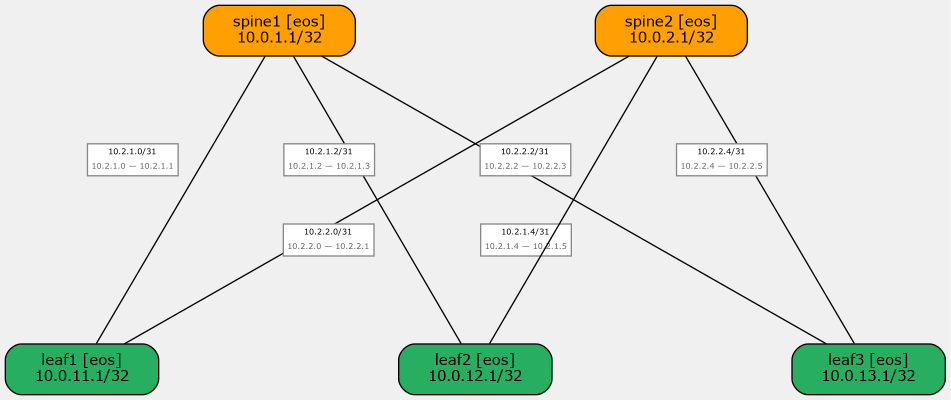

**Оборудование:** Arista cEOS 4.34.2.2F (containerlab)

**Ссылки:**
- 2 Spine × 3 Leaf = 6 point-to-point линков /31
- Loopback0 на каждом устройстве /32

---

#### Схема адресов IPv4

##### Линки Spine-Leaf

Адресация линков: `10.2.<spine>.<link>/31`, где:
- `<spine>` — номер Spine (1 или 2)
- `<link>` — порядковый номер линка (0, 2, 4 — для spine1; 0, 2, 4 — для spine2)

| Устройство | Интерфейс | Подсеть   | Локальный IP | Удалённый IP | Сосед  |
| ---------- | --------- | --------- | ------------ | ------------ | ------ |
| spine1     | Ethernet1 | 10.2.1.0/31 | 10.2.1.0    | 10.2.1.1     | leaf1  |
| spine1     | Ethernet2 | 10.2.1.2/31 | 10.2.1.2    | 10.2.1.3     | leaf2  |
| spine1     | Ethernet3 | 10.2.1.4/31 | 10.2.1.4    | 10.2.1.5     | leaf3  |
| spine2     | Ethernet1 | 10.2.2.0/31 | 10.2.2.0    | 10.2.2.1     | leaf1  |
| spine2     | Ethernet2 | 10.2.2.2/31 | 10.2.2.2    | 10.2.2.3     | leaf2  |
| spine2     | Ethernet3 | 10.2.2.4/31 | 10.2.2.4    | 10.2.2.5     | leaf3  |

##### Loopback-адреса

| Устройство | Loopback0      |
| ---------- | -------------- |
| spine1     | `10.0.1.1/32`  |
| spine2     | `10.0.2.1/32`  |
| leaf1      | `10.0.11.1/32` |
| leaf2      | `10.0.12.1/32` |
| leaf3      | `10.0.13.1/32` |

---

#### Схема распределения идентификаторов NET в IS-IS

NET-адрес: `49.0001.XXXX.XXXX.XXXX.00`, где System ID формируется из IP-адреса Loopback0 — каждый октет дополняется до 3 цифр и группируется по 4 символа.

| Устройство | Loopback IP  | System ID       | NET                               |
| ---------- | ------------ | --------------- | --------------------------------- |
| spine1     | 10.0.1.1     | 0100 0000 1001  | `49.0001.0100.0000.1001.00`      |
| spine2     | 10.0.2.1     | 0100 0000 2001  | `49.0001.0100.0000.2001.00`      |
| leaf1      | 10.0.11.1    | 0100 0011 0001  | `49.0001.0100.0011.0001.00`      |
| leaf2      | 10.0.12.1    | 0100 0012 0001  | `49.0001.0100.0012.0001.00`      |
| leaf3      | 10.0.13.1    | 0100 0013 0001  | `49.0001.0100.0013.0001.00`      |

---

#### Настройка IS-IS на Spine

<details>

<summary>spine1</summary>

```
!
interface Loopback0
  ip address 10.0.1.1/32
  isis enable CORE
!
interface Ethernet1
  isis enable CORE
  isis network point-to-point
  isis hello-interval 3
  isis hello-multiplier 3
  isis authentication mode md5
  isis authentication key 7 2D47C661223B3ACF6B2107446E6BAC3E55
  bfd interval 100 min_rx 100 multiplier 3
!
interface Ethernet2
  isis enable CORE
  isis network point-to-point
  isis hello-interval 3
  isis hello-multiplier 3
  isis authentication mode md5
  isis authentication key 7 2D47C661223B3ACF6B2107446E6BAC3E55
  bfd interval 100 min_rx 100 multiplier 3
!
interface Ethernet3
  isis enable CORE
  isis network point-to-point
  isis hello-interval 3
  isis hello-multiplier 3
  isis authentication mode md5
  isis authentication key 7 2D47C661223B3ACF6B2107446E6BAC3E55
  bfd interval 100 min_rx 100 multiplier 3
!
router isis CORE
  net 49.0001.0100.0000.1001.00
  is-type level-2
  authentication mode md5
  authentication key 7 2D47C661223B3ACF6B2107446E6BAC3E55
  !
  address-family ipv4 unicast
    maximum-paths 4
    bfd all-interfaces
!
```

</details>

<details>

<summary>spine2</summary>

```
!
interface Loopback0
  ip address 10.0.2.1/32
  isis enable CORE
!
interface Ethernet1
  isis enable CORE
  isis network point-to-point
  isis hello-interval 3
  isis hello-multiplier 3
  isis authentication mode md5
  isis authentication key 7 2D47C661223B3ACF6B2107446E6BAC3E55
  bfd interval 100 min_rx 100 multiplier 3
!
interface Ethernet2
  isis enable CORE
  isis network point-to-point
  isis hello-interval 3
  isis hello-multiplier 3
  isis authentication mode md5
  isis authentication key 7 2D47C661223B3ACF6B2107446E6BAC3E55
  bfd interval 100 min_rx 100 multiplier 3
!
interface Ethernet3
  isis enable CORE
  isis network point-to-point
  isis hello-interval 3
  isis hello-multiplier 3
  isis authentication mode md5
  isis authentication key 7 2D47C661223B3ACF6B2107446E6BAC3E55
  bfd interval 100 min_rx 100 multiplier 3
!
router isis CORE
  net 49.0001.0100.0000.2001.00
  is-type level-2
  authentication mode md5
  authentication key 7 2D47C661223B3ACF6B2107446E6BAC3E55
  !
  address-family ipv4 unicast
    maximum-paths 4
    bfd all-interfaces
!
```

</details>

---

#### Настройка IS-IS на Leaf

<details>

<summary>leaf1</summary>

```
!
interface Loopback0
  ip address 10.0.11.1/32
  isis enable CORE
!
interface Ethernet1
  isis enable CORE
  isis network point-to-point
  isis hello-interval 3
  isis hello-multiplier 3
  isis authentication mode md5
  isis authentication key 7 2D47C661223B3ACF6B2107446E6BAC3E55
  bfd interval 100 min_rx 100 multiplier 3
!
interface Ethernet2
  isis enable CORE
  isis network point-to-point
  isis hello-interval 3
  isis hello-multiplier 3
  isis authentication mode md5
  isis authentication key 7 2D47C661223B3ACF6B2107446E6BAC3E55
  bfd interval 100 min_rx 100 multiplier 3
!
router isis CORE
  net 49.0001.0100.0011.0001.00
  is-type level-2
  authentication mode md5
  authentication key 7 2D47C661223B3ACF6B2107446E6BAC3E55
  !
  address-family ipv4 unicast
    maximum-paths 4
    bfd all-interfaces
!
```

</details>

<details>

<summary>leaf2</summary>

```
!
interface Loopback0
  ip address 10.0.12.1/32
  isis enable CORE
!
interface Ethernet1
  isis enable CORE
  isis network point-to-point
  isis hello-interval 3
  isis hello-multiplier 3
  isis authentication mode md5
  isis authentication key 7 2D47C661223B3ACF6B2107446E6BAC3E55
  bfd interval 100 min_rx 100 multiplier 3
!
interface Ethernet2
  isis enable CORE
  isis network point-to-point
  isis hello-interval 3
  isis hello-multiplier 3
  isis authentication mode md5
  isis authentication key 7 2D47C661223B3ACF6B2107446E6BAC3E55
  bfd interval 100 min_rx 100 multiplier 3
!
router isis CORE
  net 49.0001.0100.0012.0001.00
  is-type level-2
  authentication mode md5
  authentication key 7 2D47C661223B3ACF6B2107446E6BAC3E55
  !
  address-family ipv4 unicast
    maximum-paths 4
    bfd all-interfaces
!
```

</details>

<details>

<summary>leaf3</summary>

```
!
interface Loopback0
  ip address 10.0.13.1/32
  isis enable CORE
!
interface Ethernet1
  isis enable CORE
  isis network point-to-point
  isis hello-interval 3
  isis hello-multiplier 3
  isis authentication mode md5
  isis authentication key 7 2D47C661223B3ACF6B2107446E6BAC3E55
  bfd interval 100 min_rx 100 multiplier 3
!
interface Ethernet2
  isis enable CORE
  isis network point-to-point
  isis hello-interval 3
  isis hello-multiplier 3
  isis authentication mode md5
  isis authentication key 7 2D47C661223B3ACF6B2107446E6BAC3E55
  bfd interval 100 min_rx 100 multiplier 3
!
router isis CORE
  net 49.0001.0100.0013.0001.00
  is-type level-2
  authentication mode md5
  authentication key 7 2D47C661223B3ACF6B2107446E6BAC3E55
  !
  address-family ipv4 unicast
    maximum-paths 4
    bfd all-interfaces
!
```

</details>

---

#### Проверка работоспособности

##### IS-IS соседство на Spine

> Ожидаемый результат: 3 соседа (leaf1, leaf2, leaf3) в состоянии **UP** на Ethernet1/2/3.

<details>
<summary>Результат</summary>

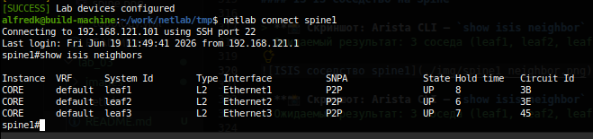

</details>

> Ожидаемый результат: 3 соседа (leaf1, leaf2, leaf3) в состоянии **UP** на Ethernet1/2/3.
<details>
<summary>Результат</summary>

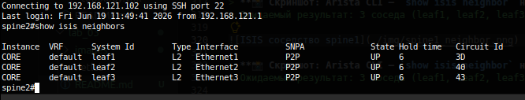

</details>

---

##### IS-IS соседство на Leaf

> Ожидаемый результат: 2 соседа (spine1, spine2) в состоянии **UP** на Ethernet1/2.

<details>
<summary>Результат</summary>

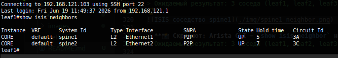

</details>

---

##### Таблица маршрутизации

> Ожидаемый результат: маршруты к Loopback0 всех Leaf-устройств через IS-IS.
<details>
<summary>Результат</summary>

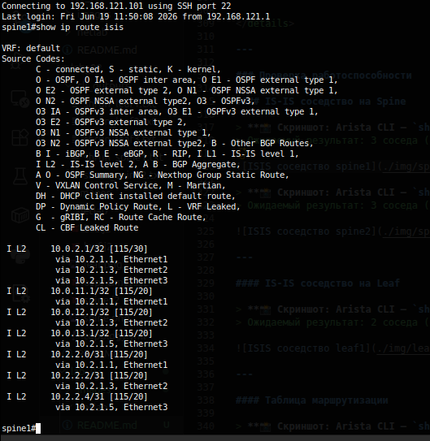

</details>

> Ожидаемый результат: маршруты к Loopback0 spine1, spine2 и других Leaf через IS-IS.

<details>
<summary>Результат</summary>

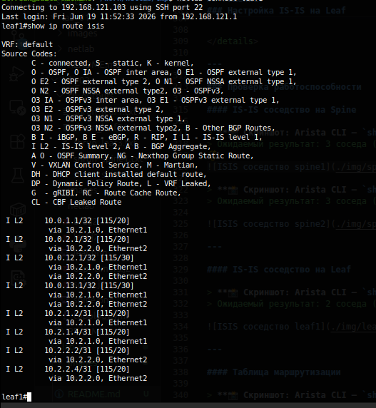

</details>

---

##### BFD-соседство

> Ожидаемый результат: BFD-сессии со всеми Leaf-устройствами в состоянии **Up**.

<details>
<summary>Результат</summary>

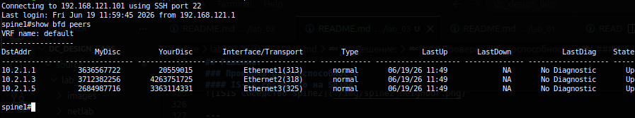

</details>

---

##### Проверка связности (Ping)

> Ожидаемый результат: успешные ICMP-ответы.

<details>
<summary>Результат</summary>

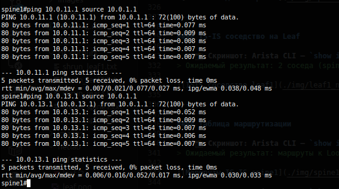

</details>

---

#### Анализ пакетов Wireshark

##### IS-IS Hello (IIH) пакет

<details>
<summary>Результат</summary>

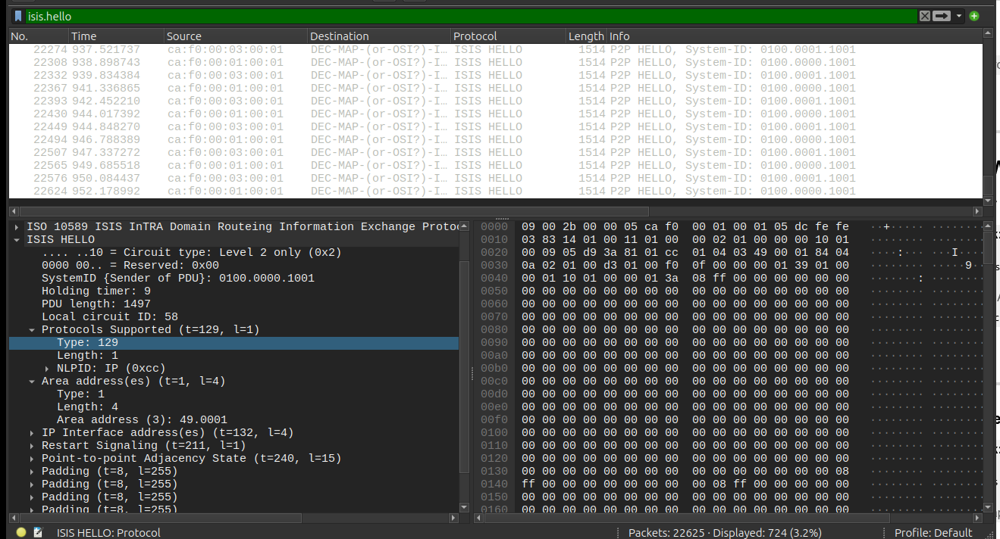

</details>

---

##### IS-IS CSNP (Complete Sequence Numbers PDU)

<details>
<summary>Результат</summary>

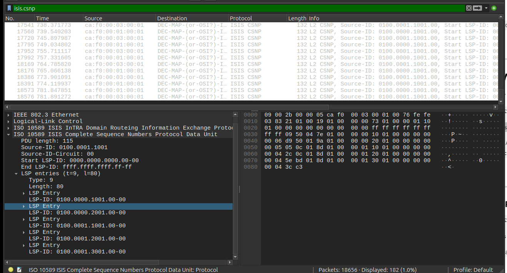

</details>

---

##### BFD Control пакет

<details>
<summary>Результат</summary>

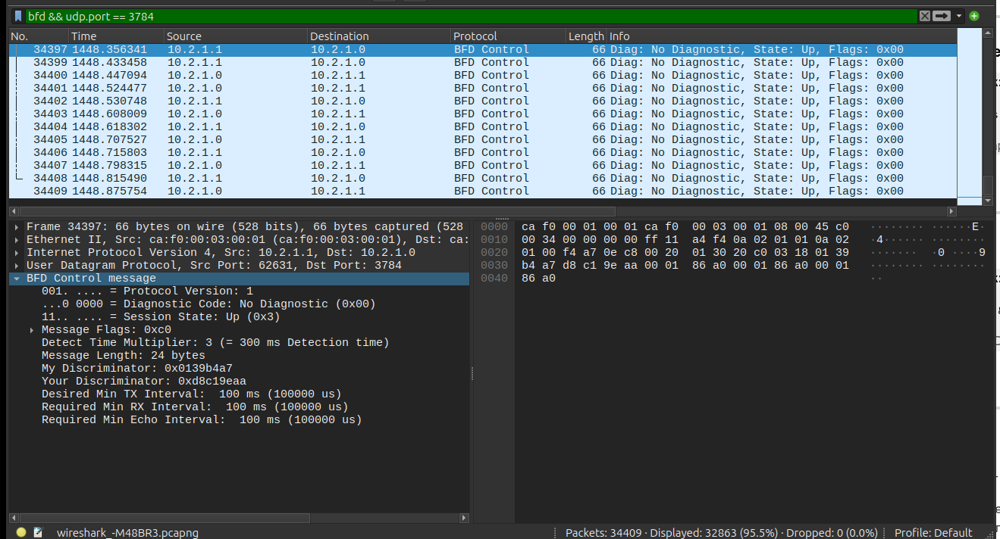

</details>

---

#### Автоматизация

Проект использует **netlab** + **containerlab** для развёртывания:

- **`topology.yml`** — определение топологии, узлов, линков, образа cEOS
- **`ip-plan.yml`** — централизованный план IP-адресации
- **`ipplan.py`** — кастомный netlab-плагин, загружающий IPs из `ip-plan.yml` через `topology_expand` hook
- **Шаблоны Jinja2:**
  - `spine.j2` / `leaf.j2` — базовая IS-IS конфигурация
  - `isis-timers.j2` — hello-interval и hello-multiplier
  - `isis-auth.j2` — MD5-аутентификация (inline key type 7)
  - `bfd.j2` — BFD для ускорения обнаружения сбоев

Команды развёртывания:
```bash
netlab up      # создание + деплой
netlab down    # остановка
```

---

#### Шаблоны конфигурации

Шаблоны Jinja2 находятся в корне проекта ('source/lab_03/netlab'):

| Файл | Назначение |
| ---- | ---------- |
| `spine.j2` | Базовая IS-IS конфигурация Spine |
| `leaf.j2` | Базовая IS-IS конфигурация Leaf |
| `isis-timers.j2` | Hello-interval и hello-multiplier |
| `isis-auth.j2` | MD5-аутентификация (inline key type 7) |
| `bfd.j2` | BFD для ускорения обнаружения сбоев |

---

#### Тестирование

Проект включает автоматические тесты на **Robot Framework** (41 тест: 27 runtime + 14 capture), которые проверяют корректность работы IS-IS, BFD и связности после развёртывания лабы.

##### Предварительные требования

- Python 3.10+ и pip
- `netlab` установлен и настроен
- Образ `ceos:4.34.2.2F` загружен в Docker
- Docker запущен

Установка Robot Framework:

```bash
pip3 install --break-system-packages robotframework python-box
robot --version
```

##### Запуск

Тесты сами управляют жизненным циклом лабы: `Suite Setup` вызывает `netlab up`, `Suite Teardown` — `netlab down`. Запускать лабу вручную **не нужно**.

```bash
cd source/lab_03/tests

# Все тесты (runtime + capture)
PYTHONPATH=. PROJECT_DIR=.. robot test_runtime.robot test_capture.robot

# Только runtime-тесты
PYTHONPATH=. PROJECT_DIR=.. robot test_runtime.robot

# Только capture-тесты
PYTHONPATH=. PROJECT_DIR=.. robot test_capture.robot
```

##### Результаты

После запуска отчёты генерируются в `tests/output/`:

| Файл | Описание |
|------|----------|
| [report.html](tests/output/report.html) | Сводка: сколько тестов прошло/упало |
| [log.html](tests/output/log.html) | Детальный лог каждого теста с выводами команд |
| [output.xml](tests/output/output.xml) | Машиночитаемый результат |

##### Структура тестов

**`test_runtime.robot`** (27 тестов) — проверка состояния POD через `netlab connect`:

| Группа | Тестов | Что проверяет |
|--------|--------|---------------|
| Lab lifecycle | 2 | `netlab up` / `netlab down` |
| Node status | 1 | Все узлы отвечают, версия Arista cEOS 4.34.2.2F |
| Interfaces | 3 | Ethernet-интерфейсы в состоянии up/up (3 на Spine, 2 на Leaf) |
| Loopback | 2 | Loopback0 с корректным IP, статус up |
| IS-IS adjacencies | 6 | Все соседства в состоянии UP (3 на Spine, 2 на Leaf) |
| IS-IS routes | 3 | Маршруты ко всем Loopback0 через IS-IS |
| BFD sessions | 4 | BFD-сессии в состоянии Up, таймеры 100ms/3 |
| Ping | 6 | Ping между всеми парами узлов через Loopback0 |

**`test_capture.robot`** (14 тестов) — захват и анализ пакетов через `docker exec + tcpdump`:

| Группа | Тестов | Что проверяет |
|--------|--------|---------------|
| IS-IS Hello (IIH) | 6 | p2p IIH, source-id, Level 2 only, area 49.0001, IPv4 NLPID |
| IS-IS CSNP | 2 | CSNP пакеты с lsp-id записями |
| BFD | 6 | State Up, UDP 3784, TTL 255, таймеры 100ms, Multiplier 3 |

##### Аппаратные требования

| Ресурс | Минимум | Рекомендовано |
|--------|---------|---------------|
| CPU | 4 ядра | 8+ ядер |
| RAM | 8 ГБ | 16+ ГБ |
| Диск | 20 ГБ свободно | 50+ ГБ (образ cEOS ~2 ГБ, контейнеры) |