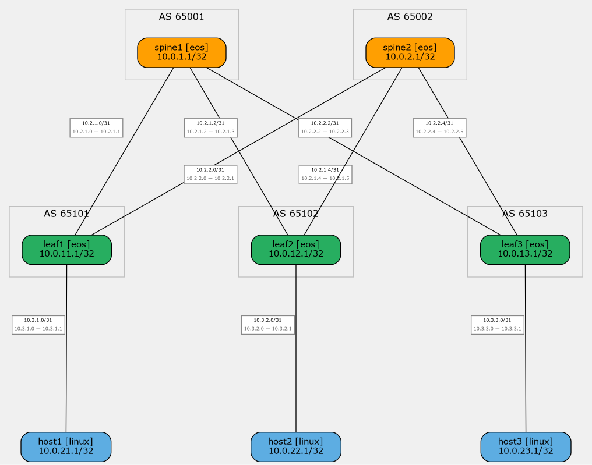

## Underlay eBGP для CLOS-сети
---
### Задание:
Настроить eBGP для Underlay сети в топологии CLOS (Spine-Leaf) с BFD для быстрой конвергенции.

---
### План работы:
 - Распределить адресное пространство underlay сети.
 - Настроить eBGP между spine и leaf узлами с уникальными ASN.
 - Включить BFD на всех P2P линках для ускорения обнаружения сбоев.
 - Подключить Linux-хосты к leaf-узлам.
 - Убедиться в наличии IP-связанности и корректной работы BGP-соседств.

---

### Решение:
Распределение адресного пространства выполнено как в предыдущей [работе](../lab_01/README.md):
<details>
<summary>Используем рекомендованную схему ЦОД (2).</summary>

**Топология CLOS:** 2 Spine + 3 Leaf + 3 Host

**Формат адресации:** `10.Dn.Sn.X/31`
Где:
- **Dn** (Data Center number):
  - `0` = Loopback0
  - `1` = Loopback1
  - `2` = P2P линки
  - `3` = Зарезервировано
  - `4-7` = Services
- **Sn** (Номер Spine):
  - `1-2` = Spine switches
  - `11-13` = Leaf switches
- **X** = Sequential number (порядковый номер)

**Интерфейсы Loopback**

| Узел (нода) | Интерфейс | IP адрес | Соединение |
|------|-----------|------------|-------------|
| spine1 | Loopback0 | 10.0.1.1/32 | Spine1-Loopback0 |
| spine2 | Loopback0 | 10.0.2.1/32 | Spine2-Loopback0 |
| leaf1 | Loopback0 | 10.0.11.1/32 | Leaf1-Loopback0 |
| leaf2 | Loopback0 | 10.0.12.1/32 | Leaf2-Loopback0 |
| leaf3 | Loopback0 | 10.0.13.1/32 | Leaf3-Loopback0 |
| host1 | -- | 10.0.21.1/32 | Host1-Loopback0 |
| host2 | -- | 10.0.22.1/32 | Host2-Loopback0 |
| host3 | -- | 10.0.23.1/32 | Host3-Loopback0 |

**Point-to-Point линки**

| Соединение | Интерфейс узла А | IP адрес на интерфейсе | Интерфейс узла B | IP адрес на интерфейсе |
|------|------------------|-----------|------------------|-----------|
| spine1-leaf1 | Ethernet1 | 10.2.1.0/31 | Ethernet1 | 10.2.1.1/31 |
| spine1-leaf2 | Ethernet2 | 10.2.1.2/31 | Ethernet1 | 10.2.1.3/31 |
| spine1-leaf3 | Ethernet3 | 10.2.1.4/31 | Ethernet1 | 10.2.1.5/31 |
| spine2-leaf1 | Ethernet1 | 10.2.2.0/31 | Ethernet2 | 10.2.2.1/31 |
| spine2-leaf2 | Ethernet2 | 10.2.2.2/31 | Ethernet2 | 10.2.2.3/31 |
| spine2-leaf3 | Ethernet3 | 10.2.2.4/31 | Ethernet2 | 10.2.2.5/31 |
| leaf1-host1 | Ethernet3 | 10.3.1.0/31 | eth1 | 10.3.1.1/31 |
| leaf2-host2 | Ethernet3 | 10.3.2.0/31 | eth1 | 10.3.2.1/31 |
| leaf3-host3 | Ethernet3 | 10.3.3.0/31 | eth1 | 10.3.3.1/31 |

**Маски подсетей:**
- Loopback: `/32`
- P2P links: `/31`

</details>

##### Конфигурация:

Для наглядной демонстрации используется модуль `bgp` netlab с кастомными Jinja2-шаблонами. Подключение шаблонов производится в секции `config` исходного файла топологии.

В итоге получим конфигурацию которая представлена следующими файлами:
| Файл | Назначение файла |
|------|------------------|
| [topology.yml](netlab/topology.yml) | Контейнер общей конфигурации. |
| [ip-plan.yml](netlab/ip-plan.yml) | Централизованный план IP-адресации. |
| [ipplan.py](netlab/ipplan.py) | Кастомный netlab-плагин, загружающий IPs из ip-plan.yml. |
| [spine.j2](netlab/spine.j2) | Шаблон конфигурации Spine (BGP, loopback, Ethernet, BFD). |
| [leaf.j2](netlab/leaf.j2) | Шаблон конфигурации Leaf (BGP, loopback, Ethernet, BFD). |
| [bfd.j2](netlab/bfd.j2) | Шаблон конфигурации BFD таймеров для интерфейсов. |
| [host1.sh](netlab/host1.sh) | Скрипт инициализации хоста 1. |
| [host2.sh](netlab/host2.sh) | Скрипт инициализации хоста 2. |
| [host3.sh](netlab/host3.sh) | Скрипт инициализации хоста 3. |

##### Топология сети



**Оборудование:** Arista cEOS 4.34.2.2F (containerlab), Ubuntu 22.04 (хосты)

**BGP параметры:**
- eBGP IPv4 Unicast между spine и leaf
- Уникальный ASN на каждом узле
- Router-id = Loopback0
- Maximum-paths 4 (ECMP)
- Redistribute connected
- BFD: interval 100ms, min_rx 100ms, multiplier 3 (~300ms detection)

**BGP ASN:**

| Узел | ASN |
|------|-----|
| spine1 | 65001 |
| spine2 | 65002 |
| leaf1 | 65101 |
| leaf2 | 65102 |
| leaf3 | 65103 |

##### Проверка:

Установка и запуск `netlab` описан в соответствующем [разделе](../setup/README.md). \
Для запуска симуляции создадим временный каталог tmp и скопируем содержимое каталога netlab.
В созданном каталоге выполним команду:
```shell
$ netlab up
```
Проверяем статус симуляции:
```
$ netlab status
```

##### BGP-соседство на Spine

> Ожидаемый результат: 3 соседа (leaf1, leaf2, leaf3) в состоянии **Established** на spine1 (AS 65001).

<details>
<summary>spine1 BGP summary</summary>

```
BGP summary information for VRF default
Router identifier 10.0.1.1, local AS number 65001
  Neighbor   V AS      MsgRcvd MsgSent  Up/Down  State   PfxRcd PfxAcc
  10.2.1.1   4 65101        8       7  00:00:39  Estab   11     11
  10.2.1.3   4 65102       10      11  00:00:38  Estab   11     11
  10.2.1.5   4 65103       10      10  00:00:36  Estab   11     11
```

</details>

> Ожидаемый результат: 3 соседа (leaf1, leaf2, leaf3) в состоянии **Established** на spine2 (AS 65002).

<details>
<summary>spine2 BGP summary</summary>

```
BGP summary information for VRF default
Router identifier 10.0.2.1, local AS number 65002
  Neighbor   V AS      MsgRcvd MsgSent  Up/Down  State   PfxRcd PfxAcc
  10.2.2.1   4 65101        6       7  00:00:40  Estab   7      7
  10.2.2.3   4 65102        6       8  00:00:38  Estab   7      7
  10.2.2.5   4 65103        6       8  00:00:37  Estab   7      7
```

</details>

##### BGP-соседство на Leaf

> Ожидаемый результат: 2 соседа (spine1, spine2) в состоянии **Established** на leaf1 (AS 65101).

<details>
<summary>leaf1 BGP summary</summary>

```
BGP summary information for VRF default
Router identifier 10.0.11.1, local AS number 65101
  Neighbor   V AS      MsgRcvd MsgSent  Up/Down  State   PfxRcd PfxAcc
  10.2.1.0   4 65001        7       8  00:00:40  Estab   10     10
  10.2.2.0   4 65002        7       6  00:00:40  Estab   10     10
```

</details>

##### Таблица маршрутизации

> Ожидаемый результат: маршруты к Loopback0 всех узлов через eBGP, ECMP где доступно.

<details>
<summary>BGP маршруты spine1</summary>

```
          Network           Next Hop   Metric LocPref Weight  Path
 * >      10.0.1.1/32       -          -      -       0       i
 * >Ec    10.0.2.1/32       10.2.1.1   0      100     0       65101 65002 i
 *  ec    10.0.2.1/32       10.2.1.3   0      100     0       65102 65002 i
 *  ec    10.0.2.1/32       10.2.1.5   0      100     0       65103 65002 i
 * >      10.0.11.1/32      10.2.1.1   0      100     0       65101 i
 * >      10.0.12.1/32      10.2.1.3   0      100     0       65102 i
 * >      10.0.13.1/32      10.2.1.5   0      100     0       65103 i
```

</details>

> Ожидаемый результат: маршруты к spine1, spine2 и другим leaf через eBGP, ECMP.

<details>
<summary>BGP маршруты leaf1</summary>

```
          Network           Next Hop   Metric LocPref Weight  Path
 * >      10.0.1.1/32       10.2.1.0   0      100     0       65001 i
 * >      10.0.2.1/32       10.2.2.0   0      100     0       65002 i
 * >      10.0.11.1/32      -          -      -       0       i
 * >Ec    10.0.12.1/32      10.2.2.0   0      100     0       65002 65102 i
 *  ec    10.0.12.1/32      10.2.1.0   0      100     0       65001 65102 i
 * >Ec    10.0.13.1/32      10.2.2.0   0      100     0       65002 65103 i
 *  ec    10.0.13.1/32      10.2.1.0   0      100     0       65001 65103 i
```

</details>

##### BFD-соседство

> Ожидаемый результат: BFD-сессии со всеми соседями в состоянии **Up**.

<details>
<summary>BFD peers spine1</summary>

```
VRF name: default
DstAddr       Interface           State
10.2.1.1      Ethernet1(161)      Up
10.2.1.3      Ethernet2(168)      Up
10.2.1.5      Ethernet3(163)      Up
```

</details>

<details>
<summary>BFD peers leaf1</summary>

```
VRF name: default
DstAddr       Interface           State
10.2.1.0      Ethernet1(162)      Up
10.2.2.0      Ethernet2(166)      Up
```

</details>

##### Проверка связности (Ping)

> Ожидаемый результат: успешные ICMP-ответы.

<details>
<summary>Ping spine1 → leaf1 Loopback (10.0.11.1)</summary>

```
PING 10.0.11.1 (10.0.11.1) from 10.0.1.1 : 72(100) bytes of data.
80 bytes from 10.0.11.1: icmp_seq=1 ttl=64 time=0.067 ms
80 bytes from 10.0.11.1: icmp_seq=2 ttl=64 time=0.009 ms
80 bytes from 10.0.11.1: icmp_seq=3 ttl=64 time=0.007 ms
80 bytes from 10.0.11.1: icmp_seq=4 ttl=64 time=0.006 ms
80 bytes from 10.0.11.1: icmp_seq=5 ttl=64 time=0.007 ms

--- 10.0.11.1 ping statistics ---
5 packets transmitted, 5 received, 0% packet loss
```

</details>

<details>
<summary>Ping leaf1 → leaf2 Loopback (10.0.12.1) via ECMP</summary>

```
PING 10.0.12.1 (10.0.12.1) from 10.0.11.1 : 72(100) bytes of data.
80 bytes from 10.0.12.1: icmp_seq=1 ttl=63 time=0.739 ms
80 bytes from 10.0.12.1: icmp_seq=2 ttl=63 time=0.416 ms
80 bytes from 10.0.12.1: icmp_seq=3 ttl=63 time=0.383 ms
80 bytes from 10.0.12.1: icmp_seq=4 ttl=63 time=0.382 ms
80 bytes from 10.0.12.1: icmp_seq=5 ttl=63 time=0.367 ms

--- 10.0.12.1 ping statistics ---
5 packets transmitted, 5 received, 0% packet loss
```

</details>

<details>
<summary>Ping spine1 → spine2 Loopback (10.0.2.1)</summary>

```
PING 10.0.2.1 (10.0.2.1) from 10.0.1.1 : 72(100) bytes of data.
80 bytes from 10.0.2.1: icmp_seq=1 ttl=63 time=0.802 ms
80 bytes from 10.0.2.1: icmp_seq=2 ttl=63 time=0.347 ms
80 bytes from 10.0.2.1: icmp_seq=3 ttl=63 time=0.320 ms
80 bytes from 10.0.2.1: icmp_seq=4 ttl=63 time=0.385 ms
80 bytes from 10.0.2.1: icmp_seq=5 ttl=63 time=0.535 ms

--- 10.0.2.1 ping statistics ---
5 packets transmitted, 5 received, 0% packet loss
```

</details>

##### Проверка версии ПО

> Ожидаемый результат: все EOS-узлы отвечают с версией Arista cEOS 4.34.2.2F.

<details>
<summary>spine1 version</summary>

```
Arista cEOSLab
Software image version: 4.34.2.2F-46218727.43422F (engineering build)
Internal build version: 4.34.2.2F-46218727.43422F
```

</details>

##### Проверка интерфейсов

> Ожидаемый результат: все Ethernet-интерфейсы в состоянии up/up (3 на Spine, 3 на Leaf).

<details>
<summary>Интерфейсы spine1</summary>

```
Interface      IP Address             Status     Protocol
-------------- ---------------------- ---------- ------------
Ethernet1      10.2.1.0/31            up         up
Ethernet2      10.2.1.2/31            up         up
Ethernet3      10.2.1.4/31            up         up
Loopback0      10.0.1.1/32            up         up
```

</details>

<details>
<summary>Интерфейсы leaf1</summary>

```
Interface      IP Address             Status     Protocol
-------------- ---------------------- ---------- ------------
Ethernet1      10.2.1.1/31            up         up
Ethernet2      10.2.2.1/31            up         up
Ethernet3      10.3.1.0/31            up         up
Loopback0      10.0.11.1/32           up         up
```

</details>

##### Проверка Loopback

> Ожидаемый результат: Loopback0 на каждом узле с корректным IP и статусом up/up.

<details>
<summary>Loopback0 на spine1 и leaf1</summary>

```
spine1: Loopback0  10.0.1.1/32    up/up
leaf1:  Loopback0  10.0.11.1/32   up/up
leaf2:  Loopback0  10.0.12.1/32   up/up
leaf3:  Loopback0  10.0.13.1/32   up/up
spine2: Loopback0  10.0.2.1/32    up/up
```

</details>

##### Маршрутизация на хостах

> Ожидаемый результат: хосты имеют default route через leaf-узел, на который подключены.

<details>
<summary>Маршруты host1</summary>

```
default via 10.3.1.0 dev eth1
10.3.1.0/31 dev eth1 proto kernel scope link src 10.3.1.1
```

</details>

<details>
<summary>Маршруты host2</summary>

```
default via 10.3.2.0 dev eth1
10.3.2.0/31 dev eth1 proto kernel scope link src 10.3.2.1
```

</details>

<details>
<summary>Маршруты host3</summary>

```
default via 10.3.3.0 dev eth1
10.3.3.0/31 dev eth1 proto kernel scope link src 10.3.3.1
```

</details>

##### Ping от хостов

> Ожидаемый результат: успешные ICMP-ответы от loopback spine/leaf и между хостами через fabric.

<details>
<summary>host1 → spine1 Loopback (10.0.1.1)</summary>

```
PING 10.0.1.1 (10.0.1.1) 56(84) bytes of data.
64 bytes from 10.0.1.1: icmp_seq=1 ttl=63 time=0.907 ms
64 bytes from 10.0.1.1: icmp_seq=2 ttl=63 time=0.490 ms
64 bytes from 10.0.1.1: icmp_seq=3 ttl=63 time=0.619 ms

--- 10.0.1.1 ping statistics ---
3 packets transmitted, 3 received, 0% packet loss
```

</details>

<details>
<summary>host1 → leaf2 Loopback (10.0.12.1)</summary>

```
PING 10.0.12.1 (10.0.12.1) 56(84) bytes of data.
64 bytes from 10.0.12.1: icmp_seq=1 ttl=62 time=1.38 ms
64 bytes from 10.0.12.1: icmp_seq=2 ttl=62 time=1.15 ms
64 bytes from 10.0.12.1: icmp_seq=3 ttl=62 time=1.01 ms

--- 10.0.12.1 ping statistics ---
3 packets transmitted, 3 received, 0% packet loss
```

</details>

<details>
<summary>host2 → host3 (10.3.3.1)</summary>

```
PING 10.3.3.1 (10.3.3.1) 56(84) bytes of data.
64 bytes from 10.3.3.1: icmp_seq=1 ttl=61 time=2.98 ms
64 bytes from 10.3.3.1: icmp_seq=2 ttl=61 time=1.89 ms
64 bytes from 10.3.3.1: icmp_seq=3 ttl=61 time=1.45 ms

--- 10.3.3.1 ping statistics ---
3 packets transmitted, 3 received, 0% packet loss
```

</details>

##### BGP+BFD

> Ожидаемый результат: BFD включён для всех BGP-соседей, состояние Up.

<details>
<summary>BFD status для BGP-соседей на spine1</summary>

```
BGP neighbor is 10.2.1.1, remote AS 65101
BFD is enabled and state is Up

BGP neighbor is 10.2.1.3, remote AS 65102
BFD is enabled and state is Up

BGP neighbor is 10.2.1.5, remote AS 65103
BFD is enabled and state is Up
```

</details>

##### BGP Router-ID

> Ожидаемый результат: router-id каждого узла совпадает с его Loopback0.

<details>
<summary>Router-ID на spine1</summary>

```
Router identifier 10.0.1.1, local AS number 65001
...
Local AS is 65001, local router ID 10.0.1.1
```

</details>

##### BGP Address-Family

> Ожидаемый результат: IPv4 Unicast активен и согласован (negotiated) со всеми соседями.

<details>
<summary>AFI/SAFI на spine1</summary>

```
Neighbor          AS Session State AFI/SAFI                AFI/SAFI State
-------- ----------- ------------- ----------------------- --------------
10.2.1.1       65101 Established   IPv4 Unicast            Negotiated
10.2.1.3       65102 Established   IPv4 Unicast            Negotiated
10.2.1.5       65103 Established   IPv4 Unicast            Negotiated
```

</details>

Полученные конфигурации узлов:
| Ссылка | Содержимое файла  |
|---|---|
| [Spine1](cli_outputs/shrun_spine1.txt) | Конфигурация узла Spine 1 |
| [Spine2](cli_outputs/shrun_spine2.txt) | Конфигурация узла Spine 2 |
| [Leaf1](cli_outputs/shrun_leaf1.txt) | Конфигурация узла Leaf 1 |
| [Leaf2](cli_outputs/shrun_leaf2.txt) | Конфигурация узла Leaf 2 |
| [Leaf3](cli_outputs/shrun_leaf3.txt) | Конфигурация узла Leaf 3 |

##### Остановка симуляции:
```
$ netlab down
```

##### Тестирование

Проект включает автоматические тесты на **Robot Framework** (41 тест), которые проверяют корректность работы eBGP, BFD и связности после развёртывания лабы.

##### Предварительные требования

- Python 3.10+ и pip
- `netlab` установлен и настроен
- Образ `ceos:4.34.2.2F` загружен в Docker
- Docker запущен

Установка Robot Framework:

```bash
pip3 install robotframework python-box
robot --version
```

##### Запуск

Тесты сами управляют жизненным циклом лабы: `Suite Setup` вызывает `netlab up`, `Suite Teardown` — `netlab down`. Запускать лабу вручную **не нужно**.

```bash
cd source/lab_04/tests

# Все тесты
PYTHONPATH=. PROJECT_DIR=.. robot --outputdir output test_ebgp.robot
```

##### Результаты

После запуска отчёты генерируются в `tests/output/`:

| Файл | Описание |
|------|----------|
| [report.html](tests/output/report.html) | Сводка: сколько тестов прошло/упало |
| [log.html](tests/output/log.html) | Детальный лог каждого теста с выводами команд |
| [output.xml](tests/output/output.xml) | Машиночитаемый результат |

##### Структура тестов

**`test_ebgp.robot`** (41 тест) — проверка состояния POD через `netlab connect`:

| Группа | Тестов | Что проверяет |
|--------|--------|---------------|
| Lab lifecycle | 2 | `netlab up` / `netlab down` |
| Node status | 1 | Все узлы отвечают, версия Arista cEOS 4.34.2.2F |
| Interfaces | 2 | Ethernet-интерфейсы в состоянии up/up (3 на Spine, 3 на Leaf) |
| Loopback | 2 | Loopback0 с корректным IP, статус up |
| BGP neighbors | 5 | Все eBGP-соседства в состоянии Established (3 на Spine, 2 на Leaf) |
| BGP routes | 5 | Маршруты ко всем Loopback0 через eBGP |
| Ping | 8 | Ping между всеми парами узлов через Loopback0 |
| Host routing | 3 | Default route на хостах через leaf |
| Host ping | 5 | Ping от хостов до loopback и между хостами |
| BFD config | 2 | BFD peers настроены на Spine и Leaf |
| BFD sessions | 2 | BFD-сессии в состоянии Up |
| BGP+BFD | 3 | BFD enabled для BGP-соседей |
| BGP router-id | 1 | Router-id = Loopback0 |
| BGP address-family | 2 | IPv4 Unicast активен |

##### Автоматизация

Проект использует **netlab** + **containerlab** для развёртывания:

- **`topology.yml`** — определение топологии, узлов, линков, образа cEOS
- **`ip-plan.yml`** — централизованный план IP-адресации
- **`ipplan.py`** — кастомный netlab-плагин, загружающий IPs из `ip-plan.yml` через `topology_expand` hook
- **Шаблоны Jinja2:**
  - `spine.j2` / `leaf.j2` — базовая eBGP конфигурация
  - `bfd.j2` — BFD таймеры для интерфейсов

Команды развёртывания:
```bash
netlab up      # создание + деплой
netlab down    # остановка
```

##### Потребление ресурсов при запуске тестов

Ниже приведены данные мониторинга ресурсов системы во время выполнения тестов Robot Framework (41 тест, ~95 секунд):

<details>
<summary>Сводка:</summary>


| Метрика | Min | Avg | Max |
|---------|-----|-----|-----|
| CPU | 8.0% | ~14.3% | 23.6% |
| Memory | 12 913 MB (5.0%) | 13 200 MB (5.1%) | 13 358 MB (5.2%) |
| Load Average | 7.43 | 10.5 | 14.13 |

> **Примечание:** Дянные приведены для системы с 256 ГБ RAM (Load Avg ~8-14).
> Лаба потребляет ~5% RAM (8 контейнеров: 5 - cEOS + 3 - Ubuntu).

</details>
