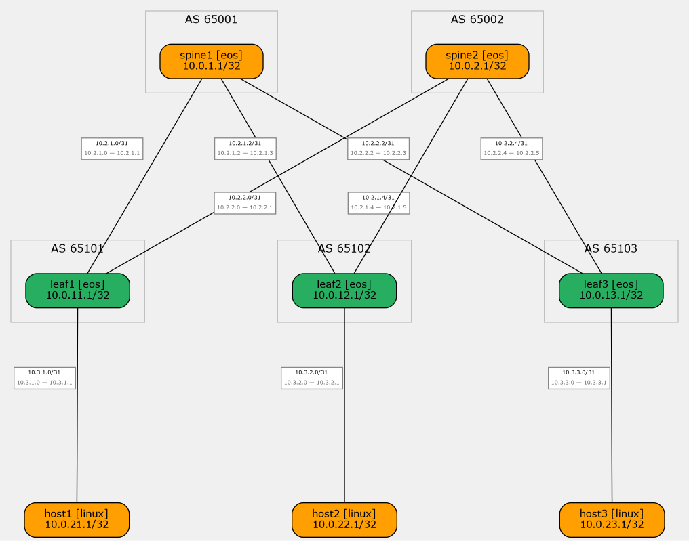

## Overlay VxLAN EVPN для L2 связанности
---
### Задание:
Настроить Overlay на основе VxLAN EVPN для L2 связанности между хостами поверх eBGP Underlay сети в топологии CLOS (Spine-Leaf) с BFD для быстрой конвергенции.

---
### План работы:
 - Использовать eBGP Underlay из [lab_04](../lab_04/README.md) для IP-связанности между VTEP.
 - Настроить Spine как BGP route reflector для EVPN (с сохранением next-hop VTEP).
 - Настроить Leaf как VTEP: VxLAN1 интерфейс, VLAN access ports, EVPN L2VNI.
 - Перевести хост-линки Leaf из routed (P2P) в switched (VLAN access).
 - Проверить BGP EVPN соседства, Type 2/3 маршруты, MAC learning через EVPN.
 - Убедиться в L2 связанности хостов через overlay (ping между хостами в одном VLAN).

---

### Решение:

#### Архитектура Overlay

**Underlay:** eBGP IPv4 Unicast (из lab_04) — обеспечивает IP-связность между VTEP (Loopback0).

**Overlay:** BGP EVPN (AFI 25 / SAFI 70) — control-plane для MAC/IP advertisement.

**Data-plane:** VxLAN (UDP 4789) — инкапсуляция L2 фреймов поверх L3 underlay.

**VTEP:** Leaf-коммутаторы, source-interface = Loopback0.

**BUM handling:** Ingress Replication (head-end replication) — без multicast в underlay.

#### Параметры Overlay

| VLAN | VNI | Route Target | RD (на каждом VTEP) | Overlay Subnet |
|------|-----|--------------|---------------------|----------------|
| 10 | 10010 | 10:10010 | `<VTEP_IP>:10010` | 192.168.10.0/24 |

**RD формат:** `<VTEP_IP>:<VNI>` — уникальный для каждого VTEP + VNI.

| Leaf | RD (VLAN 10) |
|------|---------------|
| leaf1 | 10.0.11.1:10010 |
| leaf2 | 10.0.12.1:10010 |
| leaf3 | 10.0.13.1:10010 |

**RT формат:** `<VLAN>:<VNI>` — одинаковый для всех VTEP в одном L2 домене.

#### Хосты в Overlay

| Хост | Leaf | VLAN | Overlay IP |
|------|------|------|------------|
| host1 | leaf1 | 10 | 192.168.10.11/24 |
| host2 | leaf2 | 10 | 192.168.10.12/24 |
| host3 | leaf3 | 10 | 192.168.10.13/24 |

Распределение адресного пространства underlay выполнено как в [lab_01](../lab_01/README.md):
<details>
<summary>Используем рекомендованную схему ЦОД (2).</summary>

**Топология CLOS:** 2 Spine + 3 Leaf + 3 Host

**Формат адресации:** `10.Dn.Sn.X/31`
Где:
- **Dn** (Data Center number):
  - `0` = Loopback0
  - `1` = Loopback1
  - `2` = P2P линки
  - `3` = Зарезервировано
  - `4-7` = Services
- **Sn** (Номер Spine):
  - `1-2` = Spine switches
  - `11-13` = Leaf switches
- **X** = Sequential number (порядковый номер)

**Интерфейсы Loopback**

| Узел       | Интерфейс | IP адрес     |
|------------|-----------|--------------|
| spine1     | Loopback0 | 10.0.1.1/32  |
| spine2     | Loopback0 | 10.0.2.1/32  |
| leaf1      | Loopback0 | 10.0.11.1/32 |
| leaf2      | Loopback0 | 10.0.12.1/32 |
| leaf3      | Loopback0 | 10.0.13.1/32 |

**Point-to-Point линки (Underlay)**

| Соединение  | Интерфейс A | IP A          | Интерфейс B | IP B          |
|-------------|-------------|---------------|-------------|---------------|
| spine1-leaf1 | Ethernet1   | 10.2.1.0/31  | Ethernet1   | 10.2.1.1/31  |
| spine1-leaf2 | Ethernet2   | 10.2.1.2/31  | Ethernet1   | 10.2.1.3/31  |
| spine1-leaf3 | Ethernet3   | 10.2.1.4/31  | Ethernet1   | 10.2.1.5/31  |
| spine2-leaf1 | Ethernet1   | 10.2.2.0/31  | Ethernet2   | 10.2.2.1/31  |
| spine2-leaf2 | Ethernet2   | 10.2.2.2/31  | Ethernet2   | 10.2.2.3/31  |
| spine2-leaf3 | Ethernet3   | 10.2.2.4/31  | Ethernet2   | 10.2.2.5/31  |

</details>

#### Конфигурация Spine (Route Reflector для EVPN)

Spine добавляет overlay-конфигурацию к underlay eBGP:

1. **`send-community extended`** — обязательна для передачи EVPN RT/RD
2. **`address-family evpn`** — активация EVPN AFI/SAFI на соседях
3. **`next-hop-unchanged`** — сохранение оригинального next-hop (VTEP IP) при передаче EVPN маршрутов между Leaf

<details>
<summary>spine1 — overlay конфигурация</summary>

```
router bgp 65001
  neighbor 10.2.1.1 send-community extended
  neighbor 10.2.1.3 send-community extended
  neighbor 10.2.1.5 send-community extended
  !
  address-family evpn
    neighbor 10.2.1.1 activate
    neighbor 10.2.1.1 next-hop-unchanged
    neighbor 10.2.1.3 activate
    neighbor 10.2.1.3 next-hop-unchanged
    neighbor 10.2.1.5 activate
    neighbor 10.2.1.5 next-hop-unchanged
```

</details>

#### Конфигурация Leaf (VTEP)

Leaf добавляет overlay-конфигурацию:

1. **VLAN 10** — overlay broadcast domain
2. **VxLAN1** — VTEP интерфейс с source-interface Loopback0, VLAN-to-VNI mapping, `learn-restrict any`
3. **Host-facing интерфейс** — `switchport access vlan 10` вместо routed P2P
4. **BGP EVPN** — `send-community extended`, `vlan 10` (RD/RT/redistribute learned), `address-family evpn`

<details>
<summary>leaf1 — overlay конфигурация</summary>

```
vlan 10
  name VLAN10_OVERLAY
!
interface Vxlan1
  vxlan source-interface Loopback0
  vxlan udp-port 4789
  vxlan vlan 10 vni 10010
  vxlan learn-restrict any
!
interface Ethernet3
  switchport access vlan 10
  no shutdown
!
router bgp 65101
  neighbor 10.2.1.0 send-community extended
  neighbor 10.2.2.0 send-community extended
  !
  vlan 10
    rd 10.0.11.1:10010
    route-target both 10:10010
    redistribute learned
  !
  address-family evpn
    neighbor 10.2.1.0 activate
    neighbor 10.2.2.0 activate
```

</details>

#### EVPN Route Types

**Type 2 — MAC/IP Advertisement Route:** анонсирует MAC-адреса хостов между VTEP.

**Type 3 — Inclusive Multicast Ethernet Tag (IMET):** используется для BUM-трафика. Каждый VTEP генерирует один IMET-маршрут на каждый VNI. Другие VTEP используют IMET для построения flood-списка (Ingress Replication).

#### Конфигурация хостов

Хосты получают overlay IP в VLAN 10 subnet вместо P2P IP из lab_04:

<details>
<summary>host1.sh</summary>

```bash
#!/bin/bash
sleep 2
ip addr add 192.168.10.11/24 dev eth1
ip link set eth1 up
while true; do sleep 60; done
```

</details>

##### Конфигурационные файлы:

| Файл | Назначение файла |
|------|------------------|
| [topology.yml](netlab/topology.yml) | Контейнер общей конфигурации (topology, groups, nodes). |
| [ip-plan.yml](netlab/ip-plan.yml) | Централизованный план IP-адресации (underlay + overlay). |
| [ipplan.py](netlab/ipplan.py) | Кастомный netlab-плагин, загружающий IPs из ip-plan.yml. |
| [spine.j2](netlab/spine.j2) | Шаблон конфигурации Spine (eBGP underlay + EVPN overlay). |
| [leaf.j2](netlab/leaf.j2) | Шаблон конфигурации Leaf (eBGP + VxLAN + EVPN L2VNI). |
| [bfd.j2](netlab/bfd.j2) | Шаблон конфигурации BFD таймеров для интерфейсов. |
| [host1.sh](netlab/host1.sh) | Скрипт инициализации хоста 1 (overlay IP). |
| [host2.sh](netlab/host2.sh) | Скрипт инициализации хоста 2 (overlay IP). |
| [host3.sh](netlab/host3.sh) | Скрипт инициализации хоста 3 (overlay IP). |

##### Топология сети



**Оборудование:** Arista cEOS 4.34.2.2F (containerlab), Ubuntu 22.04 (хосты)

**Underlay параметры (как в lab_04):**
- eBGP IPv4 Unicast между spine и leaf
- Уникальный ASN на каждом узле
- Maximum-paths 4 (ECMP)
- BFD: interval 100ms, min_rx 100ms, multiplier 3

**Overlay параметры:**
- BGP EVPN (AFI 25/SAFI 70) на тех же eBGP-соседствах
- VxLAN UDP port 4789
- VLAN 10 → VNI 10010
- RD: `<VTEP_IP>:<VNI>`, RT: `<VLAN>:<VNI>`
- Ingress Replication (head-end replication)
- `vxlan learn-restrict any` — control-plane MAC learning only

**BGP ASN:**

| Узел   | ASN   |
|--------|-------|
| spine1 | 65001 |
| spine2 | 65002 |
| leaf1  | 65101 |
| leaf2  | 65102 |
| leaf3  | 65103 |

##### Проверка:

Установка и запуск `netlab` описан в соответствующем [разделе](../setup/README.md).

##### Быстрый старт через Makefile

Все команды запускаются из корня `lab_05/` **без sudo** (требуется membership в группах `docker` и `clab_admins`):

```shell
$ make up            # Запустить лабу (контейнеры + конфигурация)
$ make status        # Проверить статус
$ make test          # Функциональные тесты (41 тест)
$ make test-capture  # Захват пакетов — без disruption (13 тестов)
$ make test-bounce   # Захват пакетов — с bounce интерфейсов (12 тестов)
$ make test-all      # Все тесты (каждая группа запускает/останавливает лабу отдельно)
$ make down          # Остановить лабу
```

Полный список команд: `make help`

##### Ручной запуск

```shell
$ cd netlab
$ netlab up --no-config
```

Затем вручную применяем конфигурацию на каждом узле:
```shell
$ netlab connect spine1 --configure
$ netlab connect spine2 --configure
$ netlab connect leaf1 --configure
$ netlab connect leaf2 --configure
$ netlab connect leaf3 --configure
```

Проверяем статус симуляции:
```
$ netlab status
```

##### BGP EVPN соседства на Spine

> Ожидаемый результат: 3 EVPN-соседа (leaf1, leaf2, leaf3) в состоянии **Established** на spine1.

<details>
<summary>spine1 — BGP EVPN summary</summary>

```
spine1#show bgp evpn summary
BGP summary information for VRF default
Router identifier 10.0.1.1, local AS number 65001
  Neighbor   V AS      MsgRcvd MsgSent  Up/Down  State   PfxRcd PfxAcc
  10.2.1.1   4 65101        ...       ...  ...     Estab   6      6
  10.2.1.3   4 65102        ...       ...  ...     Estab   6      6
  10.2.1.5   4 65103        ...       ...  ...     Estab   6      6
```

</details>

##### EVPN маршруты на Spine

> Ожидаемый результат: Type 3 (IMET) маршруты от каждого Leaf для VNI 10010, Type 2 (MAC/IP) после появления хостов.

<details>
<summary>spine1 — BGP EVPN routes</summary>

```
spine1#show bgp evpn
BGP routing table information for VRF default
 ...
 * >  RD: 10.0.11.1:10010 imet 10.0.11.1
 * >  RD: 10.0.12.1:10010 imet 10.0.12.1
 * >  RD: 10.0.13.1:10010 imet 10.0.13.1
 ...
```

</details>

##### VxLAN интерфейс на Leaf

> Ожидаемый результат: VxLAN1 up, source-interface Loopback0, VNI mapping VLAN 10 → 10010, Flood Mode = headend (Ingress Replication), MAC learning via EVPN.

<details>
<summary>leaf1 — VxLAN interface</summary>

```
leaf1#show interfaces vxlan 1
Vxlan1 is up, line protocol is up (connected)
  Source interface is Loopback0 and is active with 10.0.11.1
  Listening on UDP port 4789
  Replication/Flood Mode is headend with Flood List Source: EVPN
  Remote MAC learning via EVPN
  Static VLAN to VNI mapping is
    [10, 10010]
```

</details>

##### Remote VTEPs

> Ожидаемый результат: leaf1 знает о 2 удалённых VTEP (leaf2, leaf3) из Type 3 маршрутов.

<details>
<summary>leaf1 — remote VTEPs</summary>

```
leaf1#show vxlan vtep
Remote VTEPS for Vxlan1:

VTEP           Tunnel Type(s)
-------------- --------------
10.0.12.1      flood
10.0.13.1      flood

Total number of remote VTEPS:  2
```

</details>

##### MAC Address Table (EVPN)

> Ожидаемый результат: MAC-адреса хостов изучены через EVPN (Type 2 маршруты) с корректным VTEP IP.

<details>
<summary>leaf1 — VXLAN address table</summary>

```
leaf1#show vxlan address-table
          Vxlan Mac Address Table
----------------------------------------------------------------------
VLAN  Mac Address     Type      Prt  VTEP             Moves   Last Move
----  -----------     ----      ---  ----             -----   ---------
  10  <host2_mac>     EVPN      Vx1  10.0.12.1        1       ...
  10  <host3_mac>     EVPN      Vx1  10.0.13.1        1       ...
```

</details>

##### Ping между хостами (Overlay L2 связанность)

> Ожидаемый результат: host1 (192.168.10.11) → host2 (192.168.10.12) → host3 (192.168.10.13) — все ping успешны через VXLAN overlay.

<details>
<summary>host1 → host2 ping</summary>

```
host1$ ping -c 3 192.168.10.12
PING 192.168.10.12 (192.168.10.12): 56 data bytes
64 bytes from 192.168.10.12: icmp_seq=0 ttl=64 time=... ms
64 bytes from 192.168.10.12: icmp_seq=1 ttl=64 time=... ms
64 bytes from 192.168.10.12: icmp_seq=2 ttl=64 time=... ms
```

</details>

##### Захват VXLAN-трафика (VTEP-to-VTEP)

При трафике от host1 через overlay, leaf1 инкапсулирует L2 фрейм в VXLAN и отправляет по underlay к удалённым VTEP. Захват на leaf1 показывает структуру пакета:

```bash
# Запуск захвата VXLAN на leaf1 (все интерфейсы, UDP 4789)
$ docker exec clab-netlab-leaf1 tcpdump -ni any -c 2 udp port 4789 -vv
```

<details>
<summary>Пример вывода tcpdump с разбором пакета</summary>

Реальный захват показывает **Ingress Replication** — leaf1 реплицирует один и тот же inner фрейм (ICMPv6 Router Solicitation от host1) на оба удалённых VTEP:

```
tcpdump: listening on any, link-type LINUX_SLL2 (Linux cooked v2), snapshot length 262144 bytes

05:48:40.635950 et2 Out aa:c1:ab:19:19:02 ethertype IPv4 (0x0800), length 126:
    (tos 0x0, ttl 64, id 0, offset 0, flags [DF], proto UDP (17), length 106)
    10.0.11.1.128 > 10.0.13.1.4789: VXLAN, flags [I] (0x08), vni 10010
    aa:c1:ab:e3:2a:45 > 33:33:00:00:00:02, ethertype IPv6 (0x86dd), length 70:
    (hlim 255, next-header ICMPv6 (58) payload length: 16)
    fe80::a8c1:abff:fee3:2a45 > ff02::2: [icmp6 sum ok] ICMP6, router solicitation, length 16
        source link-address option (1), length 8 (1): aa:c1:ab:e3:2a:45

05:48:40.635992 et2 Out aa:c1:ab:19:19:02 ethertype IPv4 (0x0800), length 126:
    (tos 0x0, ttl 64, id 0, offset 0, flags [DF], proto UDP (17), length 106)
    10.0.11.1.128 > 10.0.12.1.4789: VXLAN, flags [I] (0x08), vni 10010
    aa:c1:ab:e3:2a:45 > 33:33:00:00:00:02, ethertype IPv6 (0x86dd), length 70:
    (hlim 255, next-header ICMPv6 (58) payload length: 16)
    fe80::a8c1:abff:fee3:2a45 > ff02::2: [icmp6 sum ok] ICMP6, router solicitation, length 16
        source link-address option (1), length 8 (1): aa:c1:ab:e3:2a:45
```

**Разбор структуры VXLAN-пакета (leaf1 → leaf3):**

```
┌───────────────────────────────────────────────────────────────────────┐
│  Outer Ethernet (underlay L2)                                        │
│  src: aa:c1:ab:19:19:02 (leaf1)  →  dst: spine MAC (next-hop)       │
│  ethertype: IPv4 (0x0800)                                            │
├───────────────────────────────────────────────────────────────────────┤
│  Outer IPv4 (underlay L3)                                            │
│  src: 10.0.11.1 (leaf1 VTEP)   →   dst: 10.0.13.1 (leaf3 VTEP)     │
│  tos: 0x0   ttl: 64   id: 0   flags: [DF]   length: 106            │
│  proto: UDP (17)                                                      │
├───────────────────────────────────────────────────────────────────────┤
│  Outer UDP                                                            │
│  src port: 128 (ephemeral, ECMP hash)  →  dst port: 4789 (VXLAN)   │
├───────────────────────────────────────────────────────────────────────┤
│  VXLAN Header (8 bytes)                                               │
│  flags: [I] (0x08) — I-bit set = VNI valid                           │
│  vni: 10010 — соответствует VLAN 10 overlay                          │
├───────────────────────────────────────────────────────────────────────┤
│  Inner Ethernet (оригинальный L2 фрейм от host1)                     │
│  src: aa:c1:ab:e3:2a:45 (host1)  →  dst: 33:33:00:00:00:02 (mcast) │
│  ethertype: IPv6 (0x86dd)                                             │
├───────────────────────────────────────────────────────────────────────┤
│  Inner IPv6                                                           │
│  src: fe80::a8c1:abff:fee3:2a45 (host1 link-local)                  │
│  dst: ff02::2 (all-routers multicast)                                │
│  hlim: 255   proto: ICMPv6 (58)                                      │
├───────────────────────────────────────────────────────────────────────┤
│  Inner ICMPv6                                                         │
│  Router Solicitation (type 133)                                       │
│  source link-address option: aa:c1:ab:e3:2a:45                       │
└───────────────────────────────────────────────────────────────────────┘
```

**Ingress Replication — два пакета с одинаковым inner, разными outer dst:**

| # | Outer src | Outer dst | Inner payload | Назначение |
|---|-----------|-----------|---------------|------------|
| 1 | 10.0.11.1 | **10.0.13.1** (leaf3 VTEP) | RS от host1 | Реплика на leaf3 |
| 2 | 10.0.11.1 | **10.0.12.1** (leaf2 VTEP) | RS от host1 | Реплика на leaf2 |

Оба пакета содержат идентичный inner фрейм — leaf1 выполнил head-end replication BUM-трафика на все remote VTEP из EVPN Type 3 (IMET) маршрутов.

**Ключевые поля для проверки:**

| Поле | Значение | Назначение |
|------|----------|------------|
| Outer src IP | 10.0.11.1 | VTEP leaf1 (source-interface Loopback0) |
| Outer dst IP | 10.0.12.1 / 10.0.13.1 | VTEP leaf2 / leaf3 (из EVPN IMET) |
| Outer dst port | 4789 | Стандартный VXLAN UDP port |
| Outer TTL | 64 | Underlay TTL (не копируется из inner) |
| VXLAN flags | [I] (0x08) | I-bit установлен — VNI валиден |
| VNI | 10010 | Overlay идентификатор (VLAN 10 → VNI 10010) |
| Inner src MAC | aa:c1:ab:e3:2a:45 | MAC host1 (оригинальный отправитель) |

**При unicast ICMP echo (ping host1 → host2) после EVPN MAC learning структура аналогична:**

```
IP 10.0.11.1 > 10.0.12.1: VXLAN, flags [I] (0x08), vni 10010
  Inner Ethernet: host1_mac > host2_mac, ethertype IPv4 (0x0800)
  Inner IPv4: 192.168.10.11 > 192.168.10.12, proto ICMP (1)
  Inner ICMP: Echo Request, id 1, seq 1
```

Отличие от BUM — только **один** пакет с outer dst на конкретный VTEP (10.0.12.1), а не репликация на все VTEP.

**Обратный трафик (leaf2 → leaf1, echo reply):**

```
IP 10.0.12.1 > 10.0.11.1: VXLAN, flags [I] (0x08), vni 10010
  Inner Ethernet: host2_mac > host1_mac, ethertype IPv4 (0x0800)
  Inner IPv4: 192.168.10.12 > 192.168.10.11, proto ICMP (1)
  Inner ICMP: Echo Reply, id 1, seq 1
```

</details>

##### ARP Suppression — подавление ARP-броадкастов в underlay

При включённом `vxlan learn-restrict any` leaf использует **EVPN control-plane** для изучения MAC-адресов. Когда host1 отправляет ARP-запрос для host2, leaf1 **не форвардит** его в underlay как VXLAN BUM-трафик, а отвечает из EVPN MAC-таблицы (proxy ARP).

```bash
# 1. Очищаем ARP-кэш host1 и запускаем ping
$ docker exec clab-netlab-host1 ip neigh flush dev eth1
$ docker exec clab-netlab-host1 ping -c 2 192.168.10.12

# 2. Захват ARP на host-facing интерфейсе leaf1 (et3)
$ docker exec clab-netlab-leaf1 tcpdump -ni et3 -c 6 arp -vv
```

<details>
<summary>Захват ARP на host-facing (et3) — leaf1 отвечает proxy ARP</summary>

```
tcpdump: listening on et3, link-type EN10MB (Ethernet), snapshot length 262144 bytes

06:01:10.210085 aa:c1:ab:e5:6b:77 > ff:ff:ff:ff:ff:ff, ethertype ARP (0x0806), length 42:
    Ethernet (len 6), IPv4 (len 4),
    Request who-has 192.168.10.12 tell 192.168.10.11, length 28

06:01:10.212675 aa:c1:ab:ca:91:4b > aa:c1:ab:e5:6b:77, ethertype ARP (0x0806), length 60:
    Ethernet (len 6), IPv4 (len 4),
    Reply 192.168.10.12 is-at aa:c1:ab:ca:91:4b, length 46

06:01:11.251033 aa:c1:ab:e5:6b:77 > ff:ff:ff:ff:ff:ff, ethertype ARP (0x0806), length 42:
    Ethernet (len 6), IPv4 (len 4),
    Request who-has 192.168.10.13 tell 192.168.10.11, length 28

06:01:11.254284 aa:c1:ab:cf:cf:42 > aa:c1:ab:e5:6b:77, ethertype ARP (0x0806), length 60:
    Ethernet (len 6), IPv4 (len 4),
    Reply 192.168.10.13 is-at aa:c1:ab:cf:cf:42, length 46

06:01:15.324815 aa:c1:ab:ca:91:4b > aa:c1:ab:e5:6b:77, ethertype ARP (0x0806), length 60:
    Ethernet (len 6), IPv4 (len 4),
    Request who-has 192.168.10.11 tell 192.168.10.12, length 46

06:01:15.324827 aa:c1:ab:e5:6b:77 > aa:c1:ab:ca:91:4b, ethertype ARP (0x0806), length 42:
    Ethernet (len 6), IPv4 (len 4),
    Reply 192.168.10.11 is-at aa:c1:ab:e5:6b:77, length 28

6 packets captured
```

</details>

**Разбор ARP exchange (host1 → host2):**

```
┌─────────────────────────────────────────────────────────────────────────┐
│  Шаг 1: host1 отправляет ARP broadcast на et3 (host-facing leaf1)      │
│                                                                         │
│  src: aa:c1:ab:e5:6b:77 (host1)  →  dst: ff:ff:ff:ff:ff:ff (broadcast)│
│  ARP Request: who-has 192.168.10.12 tell 192.168.10.11                │
│                                                                         │
│  ⚠ Этот пакет НЕ попадает в underlay — leaf1 перехватывает его        │
├─────────────────────────────────────────────────────────────────────────┤
│  Шаг 2: leaf1 отвечает proxy ARP из EVPN MAC table                    │
│                                                                         │
│  src: aa:c1:ab:ca:91:4b (host2 MAC из EVPN)                            │
│  dst: aa:c1:ab:e5:6b:77 (host1)                                        │
│  ARP Reply: 192.168.10.12 is-at aa:c1:ab:ca:91:4b                     │
│                                                                         │
│  ℹ Leaf1 НЕ использует свой MAC — подставляет MAC host2 из EVPN       │
│    (изучен через Type 2 маршрут от VTEP 10.0.12.1)                     │
├─────────────────────────────────────────────────────────────────────────┤
│  Шаг 3: host1 отправляет ICMP Echo Request напрямую на host2           │
│  (через VXLAN unicast к VTEP 10.0.12.1 — один пакет, без BUM)         │
└─────────────────────────────────────────────────────────────────────────┘
```

<details>
<summary>Захват ARP на underlay (et1, et2) — 0 пакетов</summary>

```bash
# Захват ARP на underlay интерфейсах leaf1 (et1, et2)
$ docker exec clab-netlab-leaf1 tcpdump -ni et1 -c 10 arp -vv -w /tmp/arp_et1.pcap &
$ docker exec clab-netlab-leaf1 tcpdump -ni et2 -c 10 arp -vv -w /tmp/arp_et2.pcap &

# Flush + ping (ARP suppression)
$ docker exec clab-netlab-host1 ip neigh flush dev eth1
$ docker exec clab-netlab-host1 ping -c 2 192.168.10.12
```

```
$ docker exec clab-netlab-leaf1 tcpdump -r /tmp/arp_et1.pcap -nn -vv
reading from file /tmp/arp_et1.pcap, link-type EN10MB (Ethernet)
tcpdump: truncated dump file; tried to read 4 file header bytes, only got 0

$ docker exec clab-netlab-leaf1 tcpdump -r /tmp/arp_et2.pcap -nn -vv
reading from file /tmp/arp_et2.pcap, link-type EN10MB (Ethernet)
tcpdump: truncated dump file; tried to read 4 file header bytes, only got 0
```

**На underlay интерфейсах — 0 ARP-пакетов.** ARP broadcast от host1 не покидает leaf1.

</details>

<details>
<summary>EVPN MAC table на leaf1 — подтверждение proxy ARP</summary>

```
leaf1#show vxlan address-table

          Vxlan Mac Address Table
----------------------------------------------------------------------
VLAN  Mac Address     Type      Prt  VTEP             Moves   Last Move
----  -----------     ----      ---  ----             -----   ---------
  10  aac1.abca.914b  EVPN      Vx1  10.0.12.1        1       0:02:47 ago
  10  aac1.abcf.cf42  EVPN      Vx1  10.0.13.1        1       0:02:39 ago

Total Remote Mac Addresses for this criterion: 2
```

**MAC-адреса хостов изучены через EVPN Type 2 маршруты:**

| MAC-адрес | Хост | VTEP (Type 2 next-hop) |
|-----------|------|------------------------|
| `aa:c1:ab:ca:91:4b` | host2 | 10.0.12.1 (leaf2) |
| `aa:c1:ab:cf:cf:42` | host3 | 10.0.13.1 (leaf3) |
| `aa:c1:ab:e5:6b:77` | host1 | local (et3) |

Когда host1 запрашивает "who-has 192.168.10.12", leaf1 находит MAC `aa:c1:ab:ca:91:4b` в EVPN-таблице и отвечает ARP Reply с этим MAC — **без обращения к underlay**.

</details>

**Сравнение: без и с ARP suppression**

| | Без `learn-restrict any` | С `learn-restrict any` (эта лаба) |
|---|---|---|
| ARP Request от host1 | Инкапсулируется в VXLAN BUM, реплицируется на все remote VTEP | Перехватывается leaf1 |
| Underlay ARP трафик | VXLAN-инкапсулированный ARP broadcast на et1/et2 | **0 пакетов** на underlay |
| ARP Reply host2 | Реальный host2 отвечает через VXLAN | Leaf1 отвечает proxy ARP из EVPN MAC table |
| Задержка | Первый ping: ARP timeout + VXLAN round-trip | Первый ping: мгновенный proxy ARP (~2ms) |
| Underlay нагрузка | BUM-трафик на каждый ARP | Нет BUM — только unicast VXLAN |

Полученные конфигурации узлов:
| Ссылка | Содержимое файла  |
|---|---|
| [Spine1](cli_outputs/shrun_spine1.txt) | Конфигурация узла Spine 1 |
| [Spine2](cli_outputs/shrun_spine2.txt) | Конфигурация узла Spine 2 |
| [Leaf1](cli_outputs/shrun_leaf1.txt) | Конфигурация узла Leaf 1 |
| [Leaf2](cli_outputs/shrun_leaf2.txt) | Конфигурация узла Leaf 2 |
| [Leaf3](cli_outputs/shrun_leaf3.txt) | Конфигурация узла Leaf 3 |

##### Остановка симуляции:
```
$ make down
```
Или вручную:
```
$ cd netlab && netlab down
```

##### Тестирование

Проект включает автоматические тесты на **Robot Framework**, которые проверяют корректность работы eBGP underlay, BFD, VXLAN EVPN overlay и L2 связанности хостов.

##### Предварительные требования

- Python 3.10+ и pip
- `netlab` установлен и настроен
- Образ `ceos:4.34.2.2F` загружен в Docker
- Docker запущен

Установка Robot Framework:

```bash
pip3 install robotframework python-box
robot --version
```

##### Запуск

Тесты сами управляют жизненным циклом лабы: `Suite Setup` вызывает `netlab up`, `Suite Teardown` — `netlab down`. Запускать лабу вручную **не нужно**.

```bash
# Из корня lab_05/ через Makefile:
$ make test

# Или напрямую:
cd source/lab_05/tests
PYTHONPATH=. PROJECT_DIR=.. robot --outputdir output test_evpn_vxlan.robot
```

##### Результаты

После запуска отчёты генерируются в `tests/output/`:

| Файл | Описание |
|------|----------|
| [report.html](tests/output/report.html) | Сводка: сколько тестов прошло/упало |
| [log.html](tests/output/log.html) | Детальный лог каждого теста с выводами команд |
| [output.xml](tests/output/output.xml) | Машиночитаемый результат |

##### Структура тестов

Каждая группа тестов — **самостоятельный suite** с собственным жизненным циклом лабы (запуск/остановка). Перед запуском проверяются rootless-предпосылки (docker, clab_admins, setuid, netlab defaults).

**`test_evpn_vxlan.robot`** (41 тест) — функциональная проверка Underlay + Overlay через `netlab connect`:

| Группа | Что проверяет |
|--------|---------------|
| Lab lifecycle | `netlab up` / `netlab down` |
| Underlay BGP | eBGP-соседства Established, маршруты к Loopback0 |
| Underlay BFD | BFD-сессии в состоянии Up |
| Overlay EVPN | BGP EVPN summary, EVPN route types (Type 2/3) |
| VXLAN data-plane | VxLAN1 interface, VNI mapping, VTEP list, flood list |
| Overlay L2 | MAC address table (EVPN), host ping через overlay |
| Underlay ping | Loopback-to-loopback связность |

**`test_capture.robot`** (13 тестов) — пассивный захват пакетов (без disruption):

| Группа | Что проверяет |
|--------|---------------|
| BFD | Захват BFD-пакетов: State Up, interval 100ms, multiplier 3, TTL 255 |
| LLDP | Захват LLDP-кадров на underlay-линках |
| BGP | BGP keepalive на underlay |
| VXLAN | VXLAN-инкапсуляция: UDP 4789, outer IPs (VTEP-to-VTEP), return traffic |

**`test_capture_bounce.robot`** (12 тестов) — захват пакетов с bounce интерфейсов:

| Группа | Что проверяет |
|--------|---------------|
| Host link bounce | ARP suppression (learn-restrict any), VXLAN encapsulation, BUM/Ingress Replication, EVPN MAC re-learning, overlay ping recovery |
| Underlay link bounce | BFD recovery + timers, BGP EVPN recovery, underlay ping recovery |

##### Автоматизация

Проект использует **netlab** + **containerlab** для развёртывания:

- **`topology.yml`** — определение топологии, узлов, линков, образа cEOS
- **`ip-plan.yml`** — централизованный план IP-адресации (underlay + overlay)
- **`ipplan.py`** — кастомный netlab-плагин, загружающий IPs из `ip-plan.yml` через `topology_expand` hook
- **Шаблоны Jinja2:**
  - `spine.j2` — eBGP underlay + EVPN overlay (send-community extended, address-family evpn, next-hop-unchanged)
  - `leaf.j2` — eBGP underlay + VxLAN interface + VLAN access ports + EVPN L2VNI (RD/RT/redistribute learned)
  - `bfd.j2` — BFD таймеры для интерфейсов
- **`configs/`** — готовые конфигурации для push на EOS-узлы

Команды развёртывания:
```bash
make up       # создание + деплой (из корня lab_05/)
make down     # остановка
make test     # запуск тестов
```

Или напрямую:
```bash
cd netlab/
netlab up --no-config          # Создать контейнеры без авто-конфигурации
netlab connect <node> --configure   # Применить конфигурацию на узле
```
