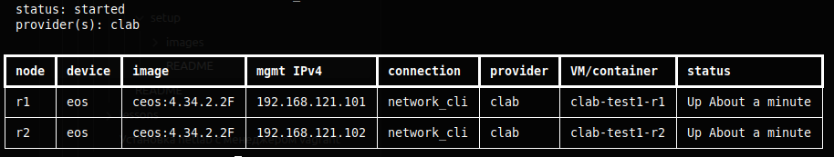
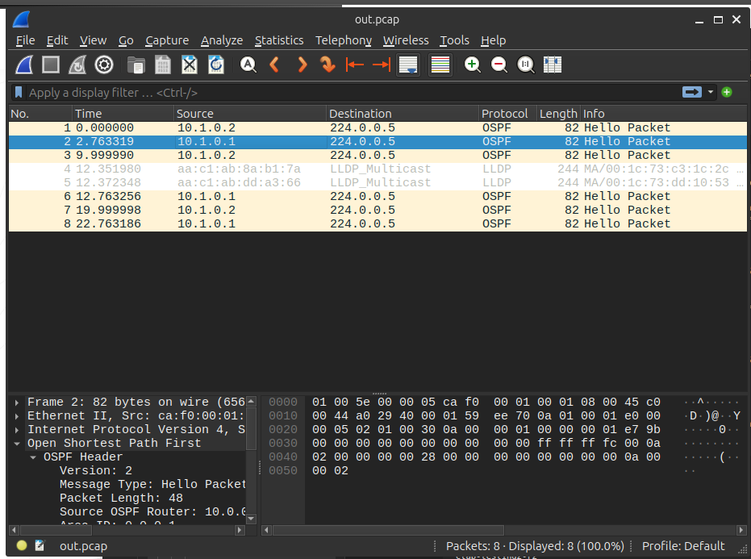
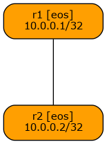

### Установка netlab с менеджером containerlab

#### Содержание

- [Установка для Ubuntu 24.04](#установка-для-ubuntu-2404)
  - [Установка containerlab](#установка-containerlab)
  - [Установка ansible](#установка-ansible)
  - [Установка визуализации](#установка-визуализации)
  - [Установка контейнера Arista cEOS для containerlab](#установка-контейнера-arista-ceos-для-containerlab)
  - [Подготовка тестового запуска](#подготовка-тестового-запуска)
  - [Тестовый запуск и просмотр трафика](#тестовый-запуск-и-просмотр-трафика)
    - [Перенаправление захваченного трафика в Wireshark](#перенаправление-захваченного-трафика-в-wireshark)
  - [Создание графической схемы топологии](#создание-графической-схемы-топологии)
  - [Подключение к ноде по SSH](#подключение-к-ноде-по-ssh)
  - [Остановка симуляции](#остановка-симуляции)

#### Установка для Ubuntu 24.04

Самый простой вариант (Ubuntu 24.04):
```shell
$ pipx install networklab
```

##### Установка containerlab
Для `Ubuntu/Linux` настоятельно рекомендуется использовать `containerlab`.
```shell
$ netlab install containerlab
```
При установке в систему будет установлен Docker.
Текущий пользователь будет добавлен в группу docker, поэтому потребуется перелогиниться или перезагрузиться.

При необходимости можно обновить пакет до последней версии (в документации указано, что тестирование проводилось с версией 0.72.0):
```shell
$ sudo containerlab version upgrade
...
	A newer containerlab 0.74.3 is available. Release notes:
	https://containerlab.dev/rn/0.74/#0743
	You are running containerlab 0.72.0 version
	Downloading https://github.com/srl-labs/containerlab/releases/download/v0.74.3/containerlab_0.74.3_linux_amd64.deb
	Preparing to install containerlab 0.74.3 from package
	(Reading database ... 265322 files and directories currently installed.)
	Preparing to unpack .../containerlab_0.74.3_linux_amd64.deb ...
	Unpacking containerlab (0.74.3) over (0.72.0) ...
	Setting up containerlab (0.74.3) ...
	
	...
	
	    version: 0.74.3
	     commit: 7eadb290a
	       date: 2026-03-24T10:00:24Z
	     source: https://github.com/srl-labs/containerlab
	 rel. notes: https://containerlab.dev/rn/0.74/#0743
```

Проверка поддерживаемых образов:
```shell
$ netlab show images
```

##### Установка `ansible`

`netlab` требует определённую версию `ansible`, поэтому, если в системе уже установлен `ansible`, следует его удалить и установить командой:
```shell
$ netlab install ansible
```

Остальные зависимости, которые могут понадобиться:
```
$ netlab install ubuntu
```

##### Установка визуализации
```
$ netlab install graph
```

##### Установка контейнера `Arista cEOS` для `containerlab`

Скачайте контейнер с сайта: https://www.arista.com/en/support/software-download
Для регистрации потребуется корпоративный почтовый ящик.

Распакуйте и установите:
```shell
$ docker image import <tar-filename> <tag>

пример:
$ docker image import ./cEOS-lab-4.34.2.2F.tar ceos:4.34.2.2F
```

##### Подготовка тестового запуска
Создайте каталог для лабораторной работы и поместите туда файл со следующим содержимым (для версии контейнера из примера):
```yaml
---
provider: clab

defaults:
  devices.eos.clab.image: "ceos:4.34.2.2F"
  device: eos

module: [ ospf ]

ospf:
  area: "0.0.0.1"

nodes: [ r1, r2 ]

links:
- r1:
  r2:
  ospf:
    area: 0.0.0.1

```

Скопируйте приведённый выше пример в файл `topology.yml` и поместите его в отдельный каталог.

Необходимо изменить системные параметры `sysctl`:
```
$ sudo sysctl net.bridge.bridge-nf-call-ip6tables=0
$ sudo sysctl net.bridge.bridge-nf-call-iptables=0
$ sudo sysctl net.bridge.bridge-nf-call-arptables=0
```

##### Тестовый запуск симуляции и просмотр трафика
В этом же каталоге выполните запуск лабораторной работы:
```shell
$ netlab up

или, если требуется более подробный вывод загрузки:

$ netlab up -vv
```

Если запуск прошёл успешно, в консоли будет выведено:
```shell
[SUCCESS] Lab devices configured
```

Проверьте статусы (должна вывестись таблица с нодами):
```
$ netlab status
```


Далее можно просмотреть трафик для ноды `r1` или `r2`:
```shell
$ netlab capture r1 Ethernet1
$ netlab capture r2 Ethernet1

```

Пример вывода (видны анонсы `OSPF` и `LLDP`):
```shell
Starting packet capture on r1/et1: sudo ip netns exec clab-testing2-r1 tcpdump -i et1 --immediate-mode -l -vv
tcpdump: listening on et1, link-type EN10MB (Ethernet), snapshot length 262144 bytes
19:32:42.434115 IP (tos 0xc0, ttl 1, id 29099, offset 0, flags [DF], proto OSPF (89), length 68)
    10.1.0.1 > 224.0.0.5: OSPFv2, Hello, length 48
	Router-ID 10.0.0.1, Area 0.0.0.1, Authentication Type: none (0)
	Options [External]
	  Hello Timer 10s, Dead Timer 40s, Mask 255.255.255.252, Priority 0
	  Neighbor List:
	    10.0.0.2
19:32:44.989551 IP (tos 0xc0, ttl 1, id 62427, offset 0, flags [DF], proto OSPF (89), length 68)
    10.1.0.2 > 224.0.0.5: OSPFv2, Hello, length 48
	Router-ID 10.0.0.2, Area 0.0.0.1, Authentication Type: none (0)
	Options [External]
	  Hello Timer 10s, Dead Timer 40s, Mask 255.255.255.252, Priority 0
	  Neighbor List:
	    10.0.0.1
19:32:48.922812 LLDP, length 230
	Chassis ID TLV (1), length 7
	  Subtype MAC address (4): 00:1c:73:18:d3:4d (oui Unknown)
	  0x0000:  0400 1c73 18d3 4d
```

Также можно записать файл для Wireshark.
Посмотрите, какие ноды присутствуют:
```shell
$ ip netns list
...
clab-testing2-r1
clab-testing2-r2
```

Запустите для выбранной ноды (см. вывод из консоли выше для команды `netlab capture`):
```shell
$ sudo ip netns exec clab-testing2-r1 tcpdump -vvi et1 -w ./out.pcap
```
Для вывода захвата напрямую в Wireshark используйте пример:
```
sudo ip netns exec clab-testing2-r1 tcpdump  et1 -U -w - | wireshark -k -i -
```

Полученный файл откройте в `Wireshark`:


###### Перенаправление захваченного трафика в Wireshark
Для прямого вывода захвата в Wireshark используйте дополнительные настройки (Ubuntu):
```
sudo groupadd pcap
sudo usermod -a -G pcap $USER
sudo usermod -a -G wireshark $USER
sudo chgrp pcap /usr/bin/tcpdump
sudo setcap cap_net_raw,cap_net_admin=eip /usr/bin/tcpdump

```
Для вступления в силу этих настроек необходимо перелогиниться или перезагрузить хост.
Далее можно использовать захват трафика и перенаправление его в Wireshark следующим образом:
```
sudo ip netns exec clab-testing2-r1 tcpdump -i et1 -U -w - | wireshark -k -i -
``` 
##### Подключение к ноде по SSH
Для подключения к ноде используем имя из namespaces:
```
$ ssh clab-testing2-r1
$ ssh clab-testing2-r2
```
Или можно воспользоваться командами netlab:
```
$ netlab connect r1
$ netlab connect r2
```

##### Создание графической схемы топологии

Сформируйте изображение с топологией:
```shell
$ netlab graph
$ dot graph.dot -T png -o test-topo.png
```



Подробнее см.: https://blog.ipspace.net/2021/09/netsim-tools-graphs/

##### Остановка симуляции

Остановите лабораторную работу:
```shell
$ netlab down
```


